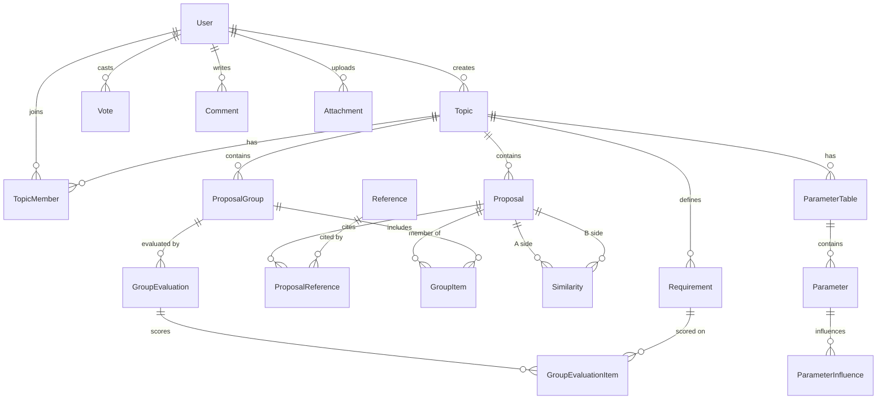

# Crowd Discusses Alternatives — Development Plan

> Derived from: `CDA core concepts.docx`, `CDA features.docx`, `Technical Documentation.docx`, `cda-menu - v7.doc`.
> Status: initial plan. The `app/` folder is currently empty — this is a greenfield implementation.

---

## 1. Scope and goals

CDA is a discussion platform whose distinguishing idea is that **a solution is not a single post — it is a *group* of small, sentence-sized proposals**, assembled from a shared pool. The platform must therefore support, as first-class concepts:

| Concept | Meaning |
|---|---|
| **Topic** | A problem/question under discussion. Ranked by importance. Has a target completion date. |
| **Requirement** | Agreed criteria a solution must satisfy. Concluded from an initial "discuss" phase. |
| **Proposal** | A sentence-sized building block. Editable until a lock date, then votable. |
| **Reference** | URL + description supporting a proposal. Voted on accuracy & importance. |
| **Comment** | Discussion *around* a proposal/group — always visually and structurally separate from it. |
| **Similarity** | A user-declared pair of near-duplicate proposals, itself votable. Used as a *user-tuned filter*. |
| **Group** | An unordered set of proposals = one alternative solution. Votable, commentable, evaluatable. |
| **Evaluation** | Per-user weight × score matrix of a group against the topic's requirements. |

Non-goals for v1: mobile apps, real-time collaborative editing, automatic (ML) similarity detection — the docs explicitly state similarity stays human-decided.

---

## 2. Technology decisions

Fixed by `Technical Documentation.docx`:

- **C# / .NET 9**
- **MariaDB (latest)**
- **MVC + REST API**

Concrete choices to fill the gaps:

| Area | Choice | Why |
|---|---|---|
| Web framework | ASP.NET Core 9 — MVC controllers + Razor views, plus `[ApiController]` REST controllers in the same host | One auth pipeline, no CORS setup, simplest to run for an open-source demo. Split into separate hosts later if needed. |
| ORM | EF Core 9 + `Pomelo.EntityFrameworkCore.MySql` 9.x | The de-facto MariaDB/MySQL provider for EF Core. |
| Schema management | EF Core migrations, applied via a dedicated migration step (never `EnsureCreated`) | Reproducible, reviewable schema history. |
| Auth | ASP.NET Core Identity (EF stores) — cookie auth for MVC, JWT bearer for `/api/*` | Per-topic roles are *not* Identity roles (see §4.2). |
| Search | MariaDB `FULLTEXT` indexes in **boolean mode** | Directly supports the required AND/OR comment search without a separate search engine. |
| Validation | FluentValidation | Keeps DTO rules out of controllers. |
| Mapping | Explicit mapping methods (no AutoMapper) | Fewer surprises, better for a codebase meant to be read. |
| Background work | `IHostedService` + an outbox table | Email digests, notification fan-out, counter reconciliation. |
| Tests | xUnit + Testcontainers (real MariaDB) + `WebApplicationFactory` | Integration tests must hit real SQL — the ranking/search logic is SQL-heavy. |
| Local dev | `docker compose` (MariaDB + adminer) | One command to a working DB. |
| CI | GitHub Actions: build → unit tests → integration tests (service container) → format check | |

**Open decision:** .NET 9 is an STS release and reaches end-of-support in **May 2026**. Since the code is being written now, strongly consider targeting **.NET 10 (LTS)** instead — the plan below is unchanged either way. Flagged for the maintainer.

---

## 3. Solution structure

```
app/
  CrowdDiscussesAlternatives.sln
  src/
    CDA.Domain/          # entities, enums, invariants. No external deps.
    CDA.Application/     # use-case services, DTOs, interfaces, validators
    CDA.Infrastructure/  # EF Core DbContext + migrations, email, file storage, localization store
    CDA.Web/             # ASP.NET Core host: MVC controllers + Razor views + /api controllers
  tests/
    CDA.UnitTests/
    CDA.IntegrationTests/
docker-compose.yml
```

Dependency rule: `Web → Application → Domain`, `Infrastructure → Application/Domain`, wired at composition root. `Domain` references nothing.

---

## 4. Data model

### 4.1 ERD (core)



### 4.2 Key entities and rules

**User** — Identity user + profile (display name, bio, contact fields) and a `ProfileFieldVisibility` map (Public/Members/Private) per field. `LastSeenAt` drives the "who is online" marker.

**TopicMember** — `(TopicId, UserId, Role)` where Role ∈ {Facilitator, Member}. Facilitator/initiator rights are **per topic**, not global Identity roles. This is the single most important modelling decision to get right early, because almost every authorization check routes through it.

**Topic** — Subject, description, `ClosesAt`, `Phase` ∈ {Discussing, Proposing, Closed}, `HideVoteCountsUntilClose` flag, denormalized `ScoreSum`/`VoteCount`.

**Requirement** — `(TopicId, Text, Order)`. Produced by the facilitator from the discuss phase (mirrors the DISCUSS → TOPIC tab flow in the Excel version).

**Proposal** — `(TopicId, AuthorId, Text, CreatedAt, EditableUntil, ManuallyLocked)`.
Invariants:
- Only the author may edit, and only while unlocked.
- `IsLocked = ManuallyLocked || EditableUntil <= UtcNow` — computed, not stored, so no scheduler is required for correctness.
- **Voting is rejected while unlocked. Commenting is always allowed.**
- Denormalized `ScoreSum`, `VoteCount`, `CommentCount`, `LastCommentAt` (the last one powers "sort by most recently commented").

**Reference** — `(CanonicalUrl UNIQUE, Description, CreatedByUserId)`. URL is canonicalized (lowercase host, strip default port / trailing slash / `utm_*`) before the uniqueness check. Linked to proposals through `ProposalReference` so **one reference can support several proposals** — this is a deliberate improvement over a strict 1:N reading of the spec, and is what makes global URL uniqueness workable.

**Vote** — one table, one row per (user, target):

```
Vote(Id, UserId, Value TINYINT CHECK (Value IN (-1,0,1)),
     TopicId?, ProposalId?, GroupId?, SimilarityId?, ReferenceId?, ReferenceAspect?)
```
- Exactly one target FK set (DB `CHECK` + domain guard).
- Unique indexes: `(UserId, TopicId)`, `(UserId, ProposalId)`, `(UserId, GroupId)`, `(UserId, SimilarityId)`, `(UserId, ReferenceId, ReferenceAspect)`. MariaDB treats NULLs as distinct, so a single table with partial-looking uniqueness works cleanly.
- `ReferenceAspect` ∈ {Accuracy, Importance} — a user casts one vote per aspect.
- Every vote write updates the target's denormalized counters **in the same transaction**. Sorting thousands of proposals by score must never require aggregating the vote table.

**Comment** — same nullable-FK pattern (`ProposalId? / GroupId? / TopicId? / SimilarityId?`), flat (no threading in v1), `Body` with a `FULLTEXT` index.

**Similarity** — `(ProposalAId, ProposalBId, CreatedByUserId, BetterWrittenProposalId, Justification)`, with IDs **normalized so A < B** and a unique index on the pair, preventing duplicate reports. Votable like anything else.

**ProposalGroup** + **GroupItem** — unordered set; unique `(GroupId, ProposalId)`; group is scoped to a topic and all its proposals must belong to that topic. Optional `ImprovesGroupId` marks "this is a variant of that group rather than a wholly new one".

**GroupEvaluation** / **GroupEvaluationItem** — `(UserId, GroupId)` unique; items are `(RequirementId, Weight, Score)`. Re-evaluation updates in place; previous versions optionally archived for history.

**ParameterTable / Parameter / ParameterInfluence** — qualitative influence matrix, `Effect` ∈ {StrongNegative, Negative, Neutral, Positive, StrongPositive} + free-text note. `IsShared` controls topic-wide visibility.

**LocalizedString** — `(Key, Culture, Value)` with `%data%` placeholders, backed by a cached custom `IStringLocalizer`. This exactly matches the localization approach described in the features doc and lets translators reorder placeholders for different grammars.

---

## 5. Algorithms worth specifying up front

These are the parts where a naive implementation will not match the documents.

### 5.1 Similarity filtering (user-defined threshold)
The user sets a minimum vote threshold `T`. Similarities with `ScoreSum >= T` are "active". Active similarities form an undirected graph over proposals; take **connected components** (union-find), and for each component display only the **representative** — the proposal marked "better written" most often, tie-broken by highest `ScoreSum`. All hidden members' votes are shown as belonging to the representative in the UI's rollup, and the UI prompts a user voting on one member to vote the same on the others (the docs' "avoidance of vote splitting"). Computed per request, cached per (topic, T).

### 5.2 Reference reputation → default group ordering
"Show first the groups of the three users whose references are the most voted."
Maintain `TopicUserReputation(TopicId, UserId, ReferenceScore)`, incremented/decremented transactionally whenever a reference vote is cast on a reference that user authored *within that topic*. Default group listing = groups by the top-3 reputation users first, then the rest by the user's chosen sort (date / votes).

### 5.3 Hidden vote counts
When `Topic.HideVoteCountsUntilClose` is set and the topic is open, the API returns items **in score order but with counts stripped** (`score: null`). This must be enforced in the DTO projection layer, not the UI — otherwise the numbers leak through the REST API. Facilitators may opt to see them.

### 5.4 Comment search with AND/OR
Parse a small query grammar (`term`, `AND`, `OR`, parentheses, quoted phrases) into a MariaDB boolean-mode `MATCH ... AGAINST` expression. Scope filters: whole topic / a single user's comments / proposal comments only. Result mode: return matching comments, or return the **proposals** whose comments match (this is the tagging/pros-cons use case from the docs).

### 5.5 Listing performance
All large lists use **keyset (cursor) pagination** on `(sortKey, Id)` with covering indexes — `(TopicId, ScoreSum DESC, Id)`, `(TopicId, CreatedAt DESC, Id)`, `(TopicId, LastCommentAt DESC, Id)`, `(TopicId, AuthorId, CreatedAt DESC)`. Offset pagination is unacceptable at the "thousands of proposals" scale the docs target.

---

## 6. REST API sketch

Versioned under `/api/v1`. `ProblemDetails` for all errors. OpenAPI document published in dev.

```
POST   /auth/register | /auth/login | /auth/refresh
GET    /users/{id}                       PUT /users/me  PUT /users/me/visibility

GET    /topics?sort=importance|date      POST /topics
GET    /topics/{id}                      PATCH /topics/{id}          (facilitator)
POST   /topics/{id}/vote                 POST /topics/{id}/phase     (facilitator)
GET    /topics/{id}/requirements         PUT  /topics/{id}/requirements (facilitator)
GET    /topics/{id}/members              POST /topics/{id}/members

GET    /topics/{id}/proposals?sort=score|date|lastComment&author=&similarityThreshold=&cursor=
POST   /topics/{id}/proposals
GET    /proposals/{id}                   PUT  /proposals/{id}        (author, unlocked)
POST   /proposals/{id}/lock              (author)
POST   /proposals/{id}/vote              (409 if unlocked)
GET    /proposals/{id}/comments          POST /proposals/{id}/comments
GET    /proposals/{id}/references        POST /proposals/{id}/references
POST   /references/{id}/vote             body: { aspect: accuracy|importance, value }

POST   /similarities                     body: { proposalAId, proposalBId, betterWrittenId, justification }
POST   /similarities/{id}/vote           GET /similarities/{id}/comments

GET    /topics/{id}/groups?sort=score|date&cursor=
POST   /topics/{id}/groups               GET /groups/{id}   (includes proposals + their comments)
POST   /groups/{id}/vote                 POST /groups/{id}/comments
GET    /groups/{id}/evaluations/me       PUT  /groups/{id}/evaluations/me

GET    /topics/{id}/search/comments?q=&author=&mode=comments|proposals

GET    /topics/{id}/parameter-tables     POST /topics/{id}/parameter-tables
PUT    /parameter-tables/{id}            POST /parameter-tables/{id}/share
```

MVC routes mirror the interface tree from `cda-menu - v7.doc`:
`Login → Topics (vote / add) → Topic → { Proposals | Groups } → detail`.

---

## 7. Delivery phases

Each phase ends with: migrations applied, API + MVC screens working, integration tests green.

### Phase 0 — Foundation *(≈1 week)*
Solution scaffold, docker-compose MariaDB, `CdaDbContext`, first migration, health check, CI pipeline, `ProblemDetails` + logging (Serilog) + OpenAPI. **Exit:** `docker compose up` then `dotnet run` yields a running app hitting MariaDB.

### Phase 1 — Identity & users *(≈1 week)*
Identity setup, register/login (cookie + JWT), profile, field-level visibility, `LastSeenAt` heartbeat. **Exit:** a user can register, log in, edit their profile, and control which fields are public.

### Phase 2 — Topics & importance ranking *(≈1 week)*
Topic CRUD, `TopicMember` roles + authorization handlers, the generic **vote engine** (single `Vote` table + transactional counter updates) proven first on topics, topic list sorted by importance. **Exit:** topics can be created, joined and ranked; a user's vote is idempotent and limited to one row.

### Phase 3 — Requirements & discuss phase *(≈0.5 week)*
Topic-level discussion thread, facilitator publishes the requirement list, `ClosesAt`, phase transitions. **Exit:** the DISCUSS → TOPIC flow from the Excel version works.

### Phase 4 — Proposals *(≈1.5 weeks)*
Proposal CRUD with the edit-window/lock lifecycle, author-only editing, vote-blocked-while-unlocked rule, comments on proposals, the three sort modes (score / date / last-commented), keyset pagination, filter by author. **Exit:** the core loop of the platform is usable end to end.

### Phase 5 — References *(≈1 week)*
Reference entity with URL canonicalization + global uniqueness, attach to proposals, two-aspect voting, `TopicUserReputation` maintenance. **Exit:** references are deduplicated and reference reputation is computed.

### Phase 6 — Similarity *(≈1 week)*
Similarity reports (normalized pairs), voting, justification comments, the connected-components filter with a user-adjustable threshold, and the "vote the same on similar proposals" prompt. **Exit:** a user can collapse duplicate proposals at a threshold of their choosing.

### Phase 7 — Groups / alternative solutions *(≈1.5 weeks)*
Group creation from selected proposals, description, group voting and comments, group detail showing member proposals *and* their comments, default ordering by top-3 reference reputation then user sort, `ImprovesGroupId` marking. **Exit:** the central "assemble a solution" feature works.

### Phase 8 — Group evaluation *(≈1 week)*
Weight × score matrix against requirements, per-user, re-editable, side-by-side comparison of two groups. **Exit:** a user can evaluate and compare alternatives before voting.

### Phase 9 — Search & discovery *(≈1 week)*
`FULLTEXT` indexes, the AND/OR query parser, search scoping (all comments / one user's comments), results as comments or as proposals, saved "tag" queries such as pros/cons. **Exit:** the tagging/categorization workflow from the docs is usable.

### Phase 10 — Vote-hiding & closing *(≈0.5 week)*
`HideVoteCountsUntilClose` enforced in projections, topic closing, read-only archive view, final results. **Exit:** counts cannot leak via the API while a topic is open.

### Phase 11 — Parameters table *(≈1 week)*
Per-user qualitative influence matrix, sharing within the topic, grid UI. **Exit:** the PARAMETERS_TABLE feature is reproduced.

### Phase 12 — Notifications, messaging, attachments *(≈1.5 weeks)*
Outbox + background sender (MailKit), per-user notification preferences and digests, personal messages, file attachments on disk behind an authorizing controller (extension allowlist, size cap, no direct static-file exposure). **Exit:** users are informed of activity without polling.

### Phase 13 — Localization *(≈0.5 week)*
DB-backed `IStringLocalizer`, `%data%` placeholder substitution, culture negotiation, translation admin screen, English + Greek seed. **Exit:** the UI renders fully in a second language.

### Phase 14 — Backlog *(unscheduled)*
Group trees / nested clustering for detailed solutions, availability calendar, SignalR presence and live updates, reference commenting, richer moderation tooling.

**Rough total for phases 0–13: ~14 weeks of focused single-developer work.**

---

## 8. Cross-cutting requirements

- **Authorization:** resource-based handlers (`CanEditProposal`, `IsTopicFacilitator`, `CanViewTopic`). Never check roles inline in controllers.
- **Concurrency:** `RowVersion` on Proposal, ProposalGroup, Requirement, ParameterTable.
- **Auditability:** `CreatedAt/By`, `UpdatedAt/By` on all mutable entities; proposal edit history retained (the docs' "history of the discussion will be available").
- **Counter integrity:** a nightly reconciliation job recomputes denormalized counters from `Vote`/`Comment` and logs drift.
- **Abuse:** rate limiting on writes, soft-delete + moderation queue, no hard deletes.
- **Accessibility & i18n:** semantic HTML, keyboard-navigable vote controls, no meaning conveyed by colour alone (matters for the parameters table).
- **Security:** anti-forgery on MVC posts, output encoding for user text (proposals/comments rendered as plain text or sanitized Markdown — never raw HTML), URL scheme allowlist (`http`/`https` only) for references, `rel="noopener noreferrer nofollow"` on outbound links.

---

## 9. Open questions for the maintainer

1. **Target framework** — .NET 9 (per the doc, EOL May 2026) or .NET 10 LTS?
2. **Reference uniqueness scope** — global across the platform (assumed here) or unique per topic?
3. **Topic visibility** — are topics public/open-registration, or invite-only per topic (the Excel version was "the facilitator shares the workbook")?
4. **Comment threading** — flat (assumed) or one level of replies?
5. **Vote value 0** — does an explicit 0 differ from "no vote" for ranking and for the participation count? (Assumed: yes, 0 is a recorded abstention.)
6. **Group membership limits** — can a group be edited after creation, and by whom?
7. **Similarity threshold default** — a global default, per topic, or purely per user?

---

## 10. Definition of done (v1)

A facilitator can open a topic, run a requirements discussion, and close it with an agreed list. Members can add sentence-sized proposals with deduplicated references, comment on and vote for them once locked, mark and vote on similarities, and filter duplicates at a threshold of their choosing. Any member can assemble groups of proposals into alternative solutions, evaluate them against the requirements with personal weights, comment on and vote for them. The whole topic is searchable with AND/OR queries over comments. Vote counts can be hidden until the topic closes. The interface is fully localizable. Everything is reachable through both the MVC UI and the REST API, and covered by integration tests running against a real MariaDB instance.
