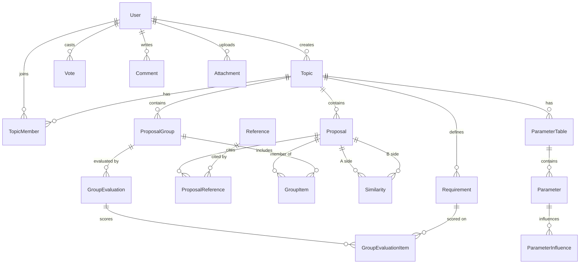

# Crowd Discusses Alternatives — Development Plan

> Derived from: `CDA core concepts.docx`, `CDA features.docx`, `Technical Documentation.docx`, `cda-menu - v7.doc`.
> Status: initial plan. The `app/` folder is currently empty — this is a greenfield implementation.

---

## 1. Scope and goals

CDA is a discussion platform whose distinguishing idea is that **a solution is not a single post — it is a *group* of small, sentence-sized proposals**, assembled from a shared pool. The platform must therefore support, as first-class concepts:

| Concept | Meaning |
|---|---|
| **Topic** | A problem/question under discussion. Ranked by importance. Has a target completion date. |
| **Requirement** | Agreed criteria a solution must satisfy. Concluded from an initial "discuss" phase. |
| **Proposal** | A sentence-sized building block. Editable until a lock date, then votable. |
| **Reference** | URL + description supporting a proposal. Voted on accuracy & importance. |
| **Comment** | Discussion *around* a proposal/group — always visually and structurally separate from it. |
| **Similarity** | A user-declared pair of near-duplicate proposals, itself votable. Used as a *user-tuned filter*. |
| **Group** | An unordered set of proposals = one alternative solution. Votable, commentable, evaluatable. |
| **Evaluation** | Per-user weight × score matrix of a group against the topic's requirements. |

Non-goals for v1: mobile apps, real-time collaborative editing, automatic (ML) similarity detection — the docs explicitly state similarity stays human-decided.

---

## 2. Technology decisions

From `Technical Documentation.docx`:

- **C# / .NET** — the doc says .NET 9; **the maintainer has chosen .NET 10 (LTS)** instead, since .NET 9 leaves support in May 2026.
- **MariaDB (latest)**
- **MVC + REST API**

Concrete choices to fill the gaps:

| Area | Choice | Why |
|---|---|---|
| Web framework | ASP.NET Core 10 — MVC controllers + Razor views, plus `[ApiController]` REST controllers in the same host | One auth pipeline, no CORS setup, simplest to run for an open-source demo. Split into separate hosts later if needed. |
| ORM | **EF Core 9 + `Pomelo.EntityFrameworkCore.MySql` 9.0.0**, running on the .NET 10 runtime | See the note below — Pomelo has no EF Core 10 release yet, and MariaDB support matters more here than the EF major version. |
| Schema management | EF Core migrations, applied via a dedicated migration step (never `EnsureCreated`) | Reproducible, reviewable schema history. |
| Auth | ASP.NET Core Identity (EF stores) — cookie auth for MVC, JWT bearer for `/api/*` | Per-topic roles are *not* Identity roles (see §4.2). |
| Search | MariaDB `FULLTEXT` indexes in **boolean mode** | Directly supports the required AND/OR comment search without a separate search engine. |
| Validation | FluentValidation | Keeps DTO rules out of controllers. |
| Mapping | Explicit mapping methods (no AutoMapper) | Fewer surprises, better for a codebase meant to be read. |
| Background work | `IHostedService` + an outbox table | Email digests, notification fan-out, counter reconciliation. |
| Tests | xUnit + `WebApplicationFactory`, integration tests against a throwaway schema on the provided server (see §2.1) | Integration tests must hit real SQL — the ranking/search logic is SQL-heavy. |
| Local dev | A **provided MariaDB instance** — no Docker, no local server install | The maintainer supplies a connection to an empty database. |
| CI | GitHub Actions: build → unit tests → format check; integration tests gated on a DB being reachable | See the CI caveat in §2.1. |

**Provider check (done, 2026-07-22).** NuGet's latest `Pomelo.EntityFrameworkCore.MySql` is **9.0.0**, targeting EF Core 9 — there is no EF Core 10 build. The options were:

- **Pomelo 9 + EF Core 9 on .NET 10** *(chosen)* — EF Core 9 assemblies run fine on the .NET 10 runtime, so the app still gets an LTS runtime. Pomelo is the de-facto MariaDB provider: it models MariaDB explicitly via `ServerVersion.AutoDetect`/`MariaDbServerVersion` and tracks MariaDB-specific SQL. The cost is that EF Core 9 itself is past its support window, so the upgrade to Pomelo 10 should be taken as soon as it ships.
- Oracle's `MySql.EntityFrameworkCore` **does** have a 10.0.x for EF Core 10, but it targets MySQL rather than MariaDB and diverges on exactly the things this schema leans on (JSON handling, index and full-text behaviour). Rejected: a supported EF major is not worth a provider that does not target our database.

Revisit at the start of Phase 0 in case Pomelo 10 has shipped by then; the rest of the plan is unaffected either way.

### 2.1 Database access and configuration

The database is an **existing, empty MariaDB instance provided by the maintainer**, reachable over the public internet. There is no container to start and no server to install.

**Verified server facts** (probed 2026-07-22 against the supplied credentials):

| Property | Value | Consequence for the build |
|---|---|---|
| Version | MariaDB **11.4.3** (LTS, Debian) | Supports everything the plan needs. |
| Schema | `CrowdDiscussesAlternatives`, **empty** (0 tables) | Migrations start from nothing, as assumed. |
| Privileges | `ALL PRIVILEGES` on that schema **and** on a second schema (see below). **No global `CREATE DATABASE`.** | Settles the test-isolation question. |
| TLS | TLS 1.3, with a certificate that passes full chain **and** hostname validation | Settled: the app connects with `SslMode=VerifyFull`; see below. |
| Charset / collation | `utf8mb4` / `utf8mb4_general_ci` | Override per column to `utf8mb4_unicode_520_ci` — the best UCA collation this build offers. `general_ci` is a legacy byte-order collation and this is a multilingual platform. (MariaDB 11.4 predates the `uca1400` collations, so `unicode_520_ci` is the ceiling here.) |
| Engine | InnoDB | Required for the `FULLTEXT` plan. **Verified working**: boolean-mode `AND`/`OR` queries returned correct results on a scratch table. |
| `innodb_ft_min_token_size` | `3` (fixed; needs a server restart to change) | **Search cannot match 1–2 character terms.** The query parser must warn the user rather than silently return nothing. |
| `ft_stopword_file` | built-in (English) | Common English words are unindexed. Only worth revisiting if English search quality disappoints. |
| `sql_mode` | `STRICT_TRANS_TABLES,ERROR_FOR_DIVISION_BY_ZERO,NO_AUTO_CREATE_USER,NO_ENGINE_SUBSTITUTION` | Strict — good. Note `ONLY_FULL_GROUP_BY` is off; do not rely on that, EF Core generates valid grouping anyway. |
| Time zone | Server is `CEST`, `time_zone=SYSTEM`; `NOW()` is 2h ahead of `UTC_TIMESTAMP()` | **Store every timestamp as UTC from the application.** Never use server-side `NOW()`/`CURRENT_TIMESTAMP` defaults — the app clock is the single source of truth, injected via an `IClock`. |
| `max_connections` | `151`, on a shared host | Cap the pool explicitly (`MaximumPoolSize=20`) so the app cannot exhaust a server it does not own. |
| `lower_case_table_names` | `0` (case-sensitive) | Table naming must be consistent; pick one convention in the EF model and never vary it. |

**Two schemas, both granted** (verified 2026-07-22):

| Schema | Purpose | Grant |
|---|---|---|
| `CrowdDiscussesAlternatives` | development / runtime | `ALL PRIVILEGES WITH GRANT OPTION` |
| `CrowdDiscussesAlternatives_Test` | integration tests, disposable | `ALL PRIVILEGES` |

Both are empty and both default to `utf8mb4` / `utf8mb4_general_ci`, so the per-column collation override applies identically to each. `CREATE DATABASE` remains denied, which is fine — no further schemas are needed.

**TLS — settled: `SslMode=VerifyFull`.** The originally supplied string ended with `SslMode=None`. Every mode was tested against the live server with **MySqlConnector** (the driver Pomelo sits on), reading `Ssl_cipher` from the session afterwards to confirm what actually happened rather than what was requested:

| `SslMode` | Result | Session cipher |
|---|---|---|
| `None` | connects | **none — traffic unencrypted** |
| `Preferred` | connects | TLS_AES_256_GCM_SHA384 |
| `Required` | connects | TLS_AES_256_GCM_SHA384 |
| `VerifyCA` | connects | TLS_AES_256_GCM_SHA384 |
| **`VerifyFull`** | **connects** | TLS_AES_256_GCM_SHA384 |

`VerifyFull` succeeding means the server presents a certificate that chains to a publicly trusted root *and* matches the hostname `<host>`. That is worth taking: `Required` encrypts but validates nothing, so it stops passive eavesdropping while remaining open to an active machine-in-the-middle; `VerifyFull` closes both. Since the strictest mode works at no cost, **the application uses `SslMode=VerifyFull` everywhere** — there is no reason to configure anything weaker.

The connection string therefore has this shape (password from user secrets / environment, never from a file in the repo):

```
Server=<host>;Port=3306;Database=CrowdDiscussesAlternatives;User ID=<user>;Password=<secret>;SslMode=VerifyFull;MaximumPoolSize=20;
```

One operational caveat: `VerifyFull` will start failing if the server's certificate expires or the host is later addressed by an IP or an alias that the certificate does not cover. That failure is the setting doing its job — the fix is to renew or reissue the certificate, not to downgrade the mode. Worth a line in the eventual deployment notes so nobody "fixes" a future outage by setting `SslMode=None`.

**Configuration:**
- The connection string is **never committed**. `appsettings.json` ships a placeholder only.
- Local development reads it from **.NET user secrets** (`dotnet user-secrets set "ConnectionStrings:Cda" "..."` on `CDA.Web`), which live outside the repo tree. The repository is public — a committed credential is a disclosed credential.
- Deployment/CI reads it from the environment variable `ConnectionStrings__Cda`.
- `.gitignore` must cover `appsettings.*.Local.json` and any `*.env` from day one, before the first commit that touches configuration.

**Schema ownership:** the app owns the whole database. Migrations are applied explicitly (`dotnet ef database update`, or a `--migrate` startup flag), never automatically on boot in a shared environment.

**Integration tests** run against `CrowdDiscussesAlternatives_Test`, never against the development schema. Docker and Testcontainers are not involved, and no schema is created per run. The fixture:

1. reads its own connection string (`ConnectionStrings:CdaTest`) — a separate setting, so the dev string can never be reused by accident;
2. **refuses to start unless the target database name ends in `_Test`**, failing with an explicit message;
3. applies migrations once per run, then truncates all tables between test classes with `FOREIGN_KEY_CHECKS=0` around the sweep.

Step 2 is a hard guard rather than a convention. Everything else here is reversible; a test run pointed at the wrong schema silently destroys the development database, so the check is worth the five lines. The full DDL cycle the fixture depends on — `CREATE TABLE ... FULLTEXT ... ENGINE=InnoDB`, `INSERT`, `TRUNCATE`, toggling `FOREIGN_KEY_CHECKS`, `DROP TABLE` — was executed successfully against the test schema on 2026-07-22.

Because there is one shared test schema rather than one per run, database-touching test classes join a single xUnit collection so they do not run concurrently; pure unit tests stay outside it and keep parallelising. Using SQLite or the in-memory provider to sidestep this was rejected: ranking, keyset pagination and `FULLTEXT` search are the SQL-heavy parts most in need of coverage, and none of them behave the same off MariaDB — such tests would pass while the product broke.

**CI caveat:** GitHub Actions service containers run on the hosted runner, not on a developer machine, so they remain a valid option for CI even though local Docker is off the table. Pointing CI at the shared provided database is not recommended — concurrent runs would trample each other's schemas. Decide between (a) a MariaDB service container in CI only, or (b) integration tests that run locally and are skipped in CI when no connection string is present.

---

## 3. Solution structure

```
app/
  CrowdDiscussesAlternatives.sln
  src/
    CDA.Domain/          # entities, enums, invariants. No external deps.
    CDA.Application/     # use-case services, DTOs, interfaces, validators
    CDA.Infrastructure/  # EF Core DbContext + migrations, email, file storage, localization store
    CDA.Web/             # ASP.NET Core host: MVC controllers + Razor views + /api controllers
  tests/
    CDA.UnitTests/
    CDA.IntegrationTests/
```

Dependency rule: `Web → Application → Domain`, `Infrastructure → Application/Domain`, wired at composition root. `Domain` references nothing.

---

## 4. Data model

### 4.1 ERD (core)



### 4.2 Key entities and rules

**User** — Identity user + profile (display name, bio, contact fields) and a `ProfileFieldVisibility` map (Public/Members/Private) per field. `LastSeenAt` drives the "who is online" marker.

**TopicMember** — `(TopicId, UserId, Role)` where Role ∈ {Facilitator, Member}. Facilitator/initiator rights are **per topic**, not global Identity roles. This is the single most important modelling decision to get right early, because almost every authorization check routes through it.

**Topic** — Subject, description, `ClosesAt`, `Phase` ∈ {Discussing, Proposing, Closed}, `HideVoteCountsUntilClose` flag, `Visibility` ∈ {Public, InviteOnly} chosen by the creator, `DefaultSimilarityThreshold`, denormalized `ScoreSum`/`VoteCount`.

`Visibility` is the gate for reading a topic: `Public` topics are readable by any authenticated user and joinable on request; `InviteOnly` topics are readable only by their `TopicMember` rows, mirroring the Excel version's "the facilitator shares the workbook". Writing always requires membership regardless of visibility. Every list query must filter on visibility — this is the one place where a missed check leaks private discussions, so it belongs in a single reusable query filter rather than being repeated per endpoint.

**Requirement** — `(TopicId, Text, Order)`. Produced by the facilitator from the discuss phase (mirrors the DISCUSS → TOPIC tab flow in the Excel version).

**Proposal** — `(TopicId, AuthorId, Text, CreatedAt, EditableUntil, ManuallyLocked)`.
Invariants:
- Only the author may edit, and only while unlocked.
- `IsLocked = ManuallyLocked || EditableUntil <= UtcNow` — computed, not stored, so no scheduler is required for correctness.
- **Voting is rejected while unlocked. Commenting is always allowed.**
- Denormalized `ScoreSum`, `VoteCount`, `CommentCount`, `LastCommentAt` (the last one powers "sort by most recently commented").

**Reference** — `(TopicId, CanonicalUrl, Description, CreatedByUserId)` with a **unique index on `(TopicId, CanonicalUrl)`** — uniqueness is scoped per topic, so the same source can legitimately be cited in two different discussions and each topic keeps its own description and vote tally for it. URL is canonicalized (lowercase host, strip default port / trailing slash / `utm_*`) before the uniqueness check. Linked to proposals through `ProposalReference` so one reference can support several proposals within its topic; a `CHECK`/domain guard enforces that the proposal and the reference belong to the same topic.

**Vote** — one table, one row per (user, target):

```
Vote(Id, UserId, Value TINYINT CHECK (Value IN (-1,0,1)),
     TopicId?, ProposalId?, GroupId?, SimilarityId?, ReferenceId?, ReferenceAspect?)
```
- Exactly one target FK set (DB `CHECK` + domain guard).
- Unique indexes: `(UserId, TopicId)`, `(UserId, ProposalId)`, `(UserId, GroupId)`, `(UserId, SimilarityId)`, `(UserId, ReferenceId, ReferenceAspect)`. MariaDB treats NULLs as distinct, so a single table with partial-looking uniqueness works cleanly.
- `ReferenceAspect` ∈ {Accuracy, Importance} — a user casts one vote per aspect.
- **An explicit `0` is a recorded abstention, not the absence of a vote.** It contributes nothing to `ScoreSum` but does increment `VoteCount` and counts as participation, so "50 people considered this, 20 were neutral" is distinguishable from "30 people saw it". Retracting a vote deletes the row; voting 0 does not.
- Every vote write updates the target's denormalized counters **in the same transaction**. Sorting thousands of proposals by score must never require aggregating the vote table.

**Comment** — same nullable-FK pattern (`ProposalId? / GroupId? / TopicId? / SimilarityId?`), flat (no threading in v1), `Body` with a `FULLTEXT` index.

**Similarity** — `(ProposalAId, ProposalBId, CreatedByUserId, BetterWrittenProposalId, Justification)`, with IDs **normalized so A < B** and a unique index on the pair, preventing duplicate reports. Votable like anything else.

**ProposalGroup** + **GroupItem** — unordered set; unique `(GroupId, ProposalId)`; group is scoped to a topic and all its proposals must belong to that topic. Optional `ImprovesGroupId` marks "this is a variant of that group rather than a wholly new one". **A group stays editable after creation, but only by its creator** — same rule as proposals. Because votes are already attached to the group, edits shift the meaning of existing votes: record an `EditedAt` and surface "edited after N votes" in the UI, and consider prompting the creator to fork a new group (via `ImprovesGroupId`) once the group has votes.

**GroupEvaluation** / **GroupEvaluationItem** — `(UserId, GroupId)` unique; items are `(RequirementId, Weight, Score)`. Re-evaluation updates in place; previous versions optionally archived for history.

**ParameterTable / Parameter / ParameterInfluence** — qualitative influence matrix, `Effect` ∈ {StrongNegative, Negative, Neutral, Positive, StrongPositive} + free-text note. `IsShared` controls topic-wide visibility.

**LocalizedString** — `(Key, Culture, Value)` with `%data%` placeholders, backed by a cached custom `IStringLocalizer`. This exactly matches the localization approach described in the features doc and lets translators reorder placeholders for different grammars.

---

## 5. Algorithms worth specifying up front

These are the parts where a naive implementation will not match the documents.

### 5.1 Similarity filtering (user-defined threshold)
Each topic carries a `DefaultSimilarityThreshold` set by its facilitator; a user may override it for their own session, but the topic value is what everyone sees by default. Similarities with `ScoreSum >= T` are "active". Active similarities form an undirected graph over proposals; take **connected components** (union-find), and for each component display only the **representative** — the proposal marked "better written" most often, tie-broken by highest `ScoreSum`. All hidden members' votes are shown as belonging to the representative in the UI's rollup, and the UI prompts a user voting on one member to vote the same on the others (the docs' "avoidance of vote splitting"). Computed per request, cached per (topic, T).

### 5.2 Reference reputation → default group ordering
"Show first the groups of the three users whose references are the most voted."
Maintain `TopicUserReputation(TopicId, UserId, ReferenceScore)`, incremented/decremented transactionally whenever a reference vote is cast on a reference that user authored *within that topic*. Default group listing = groups by the top-3 reputation users first, then the rest by the user's chosen sort (date / votes).

### 5.3 Hidden vote counts
When `Topic.HideVoteCountsUntilClose` is set and the topic is open, the API returns items **in score order but with counts stripped** (`score: null`). This must be enforced in the DTO projection layer, not the UI — otherwise the numbers leak through the REST API. Facilitators may opt to see them.

### 5.4 Comment search with AND/OR
Parse a small query grammar (`term`, `AND`, `OR`, parentheses, quoted phrases) into a MariaDB boolean-mode `MATCH ... AGAINST` expression. Scope filters: whole topic / a single user's comments / proposal comments only. Result mode: return matching comments, or return the **proposals** whose comments match (this is the tagging/pros-cons use case from the docs).

### 5.5 Listing performance
All large lists use **keyset (cursor) pagination** on `(sortKey, Id)` with covering indexes — `(TopicId, ScoreSum DESC, Id)`, `(TopicId, CreatedAt DESC, Id)`, `(TopicId, LastCommentAt DESC, Id)`, `(TopicId, AuthorId, CreatedAt DESC)`. Offset pagination is unacceptable at the "thousands of proposals" scale the docs target.

---

## 6. REST API sketch

Versioned under `/api/v1`. `ProblemDetails` for all errors. OpenAPI document published in dev.

```
POST   /auth/register | /auth/login | /auth/refresh
GET    /users/{id}                       PUT /users/me  PUT /users/me/visibility

GET    /topics?sort=importance|date      POST /topics
GET    /topics/{id}                      PATCH /topics/{id}          (facilitator)
POST   /topics/{id}/vote                 POST /topics/{id}/phase     (facilitator)
GET    /topics/{id}/requirements         PUT  /topics/{id}/requirements (facilitator)
GET    /topics/{id}/members              POST /topics/{id}/members

GET    /topics/{id}/proposals?sort=score|date|lastComment&author=&similarityThreshold=&cursor=
POST   /topics/{id}/proposals
GET    /proposals/{id}                   PUT  /proposals/{id}        (author, unlocked)
POST   /proposals/{id}/lock              (author)
POST   /proposals/{id}/vote              (409 if unlocked)
GET    /proposals/{id}/comments          POST /proposals/{id}/comments
GET    /proposals/{id}/references        POST /proposals/{id}/references
POST   /references/{id}/vote             body: { aspect: accuracy|importance, value }

POST   /similarities                     body: { proposalAId, proposalBId, betterWrittenId, justification }
POST   /similarities/{id}/vote           GET /similarities/{id}/comments

GET    /topics/{id}/groups?sort=score|date&cursor=
POST   /topics/{id}/groups               GET /groups/{id}   (includes proposals + their comments)
POST   /groups/{id}/vote                 POST /groups/{id}/comments
GET    /groups/{id}/evaluations/me       PUT  /groups/{id}/evaluations/me

GET    /topics/{id}/search/comments?q=&author=&mode=comments|proposals

GET    /topics/{id}/parameter-tables     POST /topics/{id}/parameter-tables
PUT    /parameter-tables/{id}            POST /parameter-tables/{id}/share
```

MVC routes mirror the interface tree from `cda-menu - v7.doc`:
`Login → Topics (vote / add) → Topic → { Proposals | Groups } → detail`.

---

## 7. Delivery phases

Each phase ends with: migrations applied, API + MVC screens working, integration tests green.

### Phase 0 — Foundation *(≈1 week)*
Solution scaffold, `.gitignore` + user-secrets wiring for the supplied connection string (§2.1), `CdaDbContext`, first migration applied to the empty database, health check that reports DB connectivity, CI pipeline, `ProblemDetails` + logging (Serilog) + OpenAPI. **Exit:** `dotnet run` yields a running app connected to the provided MariaDB, with the schema created by migrations and no credentials in the repo.

### Phase 1 — Identity & users *(≈1 week)*
Identity setup, register/login (cookie + JWT), profile, field-level visibility, `LastSeenAt` heartbeat. **Exit:** a user can register, log in, edit their profile, and control which fields are public.

### Phase 2 — Topics & importance ranking *(≈1 week)*
Topic CRUD, `TopicMember` roles + authorization handlers, the generic **vote engine** (single `Vote` table + transactional counter updates) proven first on topics, topic list sorted by importance. **Exit:** topics can be created, joined and ranked; a user's vote is idempotent and limited to one row.

### Phase 3 — Requirements & discuss phase *(≈0.5 week)*
Topic-level discussion thread, facilitator publishes the requirement list, `ClosesAt`, phase transitions. **Exit:** the DISCUSS → TOPIC flow from the Excel version works.

### Phase 4 — Proposals *(≈1.5 weeks)*
Proposal CRUD with the edit-window/lock lifecycle, author-only editing, vote-blocked-while-unlocked rule, comments on proposals, the three sort modes (score / date / last-commented), keyset pagination, filter by author. **Exit:** the core loop of the platform is usable end to end.

### Phase 5 — References *(≈1 week)*
Reference entity with URL canonicalization + global uniqueness, attach to proposals, two-aspect voting, `TopicUserReputation` maintenance. **Exit:** references are deduplicated and reference reputation is computed.

### Phase 6 — Similarity *(≈1 week)*
Similarity reports (normalized pairs), voting, justification comments, the connected-components filter with a user-adjustable threshold, and the "vote the same on similar proposals" prompt. **Exit:** a user can collapse duplicate proposals at a threshold of their choosing.

### Phase 7 — Groups / alternative solutions *(≈1.5 weeks)*
Group creation from selected proposals, description, group voting and comments, group detail showing member proposals *and* their comments, default ordering by top-3 reference reputation then user sort, `ImprovesGroupId` marking. **Exit:** the central "assemble a solution" feature works.

### Phase 8 — Group evaluation *(≈1 week)*
Weight × score matrix against requirements, per-user, re-editable, side-by-side comparison of two groups. **Exit:** a user can evaluate and compare alternatives before voting.

### Phase 9 — Search & discovery *(≈1 week)*
`FULLTEXT` indexes, the AND/OR query parser, search scoping (all comments / one user's comments), results as comments or as proposals, saved "tag" queries such as pros/cons. **Exit:** the tagging/categorization workflow from the docs is usable.

### Phase 10 — Vote-hiding & closing *(≈0.5 week)*
`HideVoteCountsUntilClose` enforced in projections, topic closing, read-only archive view, final results. **Exit:** counts cannot leak via the API while a topic is open.

### Phase 11 — Parameters table *(≈1 week)*
Per-user qualitative influence matrix, sharing within the topic, grid UI. **Exit:** the PARAMETERS_TABLE feature is reproduced.

### Phase 12 — Notifications, messaging, attachments *(≈1.5 weeks)*
Outbox + background sender (MailKit), per-user notification preferences and digests, personal messages, file attachments on disk behind an authorizing controller (extension allowlist, size cap, no direct static-file exposure). **Exit:** users are informed of activity without polling.

### Phase 13 — Localization *(≈0.5 week)*
DB-backed `IStringLocalizer`, `%data%` placeholder substitution, culture negotiation, translation admin screen, English + Greek seed. **Exit:** the UI renders fully in a second language.

### Phase 14 — Backlog *(unscheduled)*
Group trees / nested clustering for detailed solutions, availability calendar, SignalR presence and live updates, reference commenting, richer moderation tooling.

**Rough total for phases 0–13: ~14 weeks of focused single-developer work.**

---

## 8. Cross-cutting requirements

- **Authorization:** resource-based handlers (`CanEditProposal`, `IsTopicFacilitator`, `CanViewTopic`). Never check roles inline in controllers.
- **Concurrency:** `RowVersion` on Proposal, ProposalGroup, Requirement, ParameterTable.
- **Auditability:** `CreatedAt/By`, `UpdatedAt/By` on all mutable entities; proposal edit history retained (the docs' "history of the discussion will be available").
- **Counter integrity:** a nightly reconciliation job recomputes denormalized counters from `Vote`/`Comment` and logs drift.
- **Abuse:** rate limiting on writes, soft-delete + moderation queue, no hard deletes.
- **Accessibility & i18n:** semantic HTML, keyboard-navigable vote controls, no meaning conveyed by colour alone (matters for the parameters table).
- **Security:** anti-forgery on MVC posts, output encoding for user text (proposals/comments rendered as plain text or sanitized Markdown — never raw HTML), URL scheme allowlist (`http`/`https` only) for references, `rel="noopener noreferrer nofollow"` on outbound links.

---

## 9. Decisions and remaining questions

### Resolved by the maintainer

| # | Question | Decision | Where it lands |
|---|---|---|---|
| 1 | Target framework | **.NET 10 (LTS)**, not the .NET 9 named in the docs | §2 |
| 2 | Reference uniqueness scope | **Per topic** — unique `(TopicId, CanonicalUrl)` | §4.2 Reference |
| 3 | Topic visibility | **Both** — the creator picks Public or InviteOnly per topic | §4.2 Topic |
| 4 | Comment threading | **Flat**, no replies in v1 | §4.2 Comment |
| 5 | Vote value 0 | **Distinct from no vote** — a recorded abstention | §4.2 Vote |
| 6 | Group editing | **Editable, creator only** | §4.2 ProposalGroup |
| 7 | Similarity threshold | **Per topic** default, user-overridable for their own view | §4.2 Topic, §5.1 |
| 8 | Database host | **Provided remote MariaDB 11.4.3**, no Docker; verified empty and writable | §2.1 |
| 9 | Schemas | **`CrowdDiscussesAlternatives`** for development, **`CrowdDiscussesAlternatives_Test`** for integration tests; both granted to `<user>`, both verified | §2.1 |
| 10 | EF provider | **Pomelo 9 / EF Core 9 on the .NET 10 runtime** — Pomelo has no EF Core 10 build, and MariaDB support outweighs the EF major version | §2 |
| 11 | Transport security | **`SslMode=VerifyFull`** — verified working against the live server, replacing the original `SslMode=None` | §2.1 |

`Technical Documentation.docx` still names .NET 9 and should be updated to match decision 1, so the two documents do not contradict each other.

### Still open

1. **CI database strategy** — MariaDB service container in CI, or skip integration tests when no connection string is present (§2.1). Pointing CI at the shared server is not viable: concurrent runs would truncate each other's tables.
3. **Credential hygiene** — the `<user>` account is granted from any host (`<user>@%`) on a publicly reachable server, and its password has been shared in plaintext. Restrict the grant to known source hosts if the hosting allows it, and rotate the password before anything resembling production data exists.
4. **Public topic write access** — on a Public topic, can any authenticated user post immediately, or do they join first and the facilitator approves? Assumed: join is automatic on first write, no approval.
5. **Email delivery** — which SMTP provider, and is a sending domain available? Needed by Phase 12, not before.

---

## 10. Definition of done (v1)

A facilitator can open a topic, run a requirements discussion, and close it with an agreed list. Members can add sentence-sized proposals with deduplicated references, comment on and vote for them once locked, mark and vote on similarities, and filter duplicates at a threshold of their choosing. Any member can assemble groups of proposals into alternative solutions, evaluate them against the requirements with personal weights, comment on and vote for them. The whole topic is searchable with AND/OR queries over comments. Vote counts can be hidden until the topic closes. The interface is fully localizable. Everything is reachable through both the MVC UI and the REST API, and covered by integration tests running against a real MariaDB instance. No credential ever appears in the repository.
