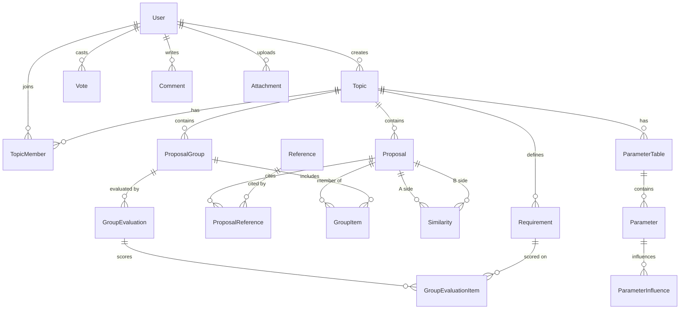

# Crowd Discusses Alternatives — Development Plan

> Derived from: `CDA core concepts.docx`, `CDA features.docx`, `Technical Documentation.docx`, `cda-menu - v7.doc`.
> For what the platform does *today*, from a participant's point of view, see [manual.md](manual.md) — kept current as each phase lands.
> Status: initial plan. The `app/` folder is currently empty — this is a greenfield implementation.

---

## 1. Scope and goals

CDA is a discussion platform whose distinguishing idea is that **a solution is not a single post — it is a *group* of small, sentence-sized proposals**, assembled from a shared pool. The platform must therefore support, as first-class concepts:

| Concept | Meaning |
|---|---|
| **Topic** | A problem/question under discussion. Ranked by importance. Has a target completion date. |
| **Requirement** | Agreed criteria a solution must satisfy. Concluded from an initial "discuss" phase. |
| **Proposal** | A sentence-sized building block. Editable until a lock date, then votable. |
| **Reference** | URL + description supporting a proposal. Voted on accuracy & importance. |
| **Comment** | Discussion *around* a proposal/group — always visually and structurally separate from it. |
| **Similarity** | A user-declared pair of near-duplicate proposals, itself votable. Used as a *user-tuned filter*. |
| **Group** | An unordered set of proposals = one alternative solution. Votable, commentable, evaluatable. |
| **Evaluation** | Per-user weight × score matrix of a group against the topic's requirements. |

Non-goals for v1: mobile apps, real-time collaborative editing, automatic (ML) similarity detection — the docs explicitly state similarity stays human-decided.

---

## 2. Technology decisions

From `Technical Documentation.docx`:

- **C# / .NET** — the doc says .NET 9; **the maintainer has chosen .NET 10 (LTS)** instead, since .NET 9 leaves support in May 2026.
- **MariaDB (latest)**
- **MVC + REST API**

Concrete choices to fill the gaps:

| Area | Choice | Why |
|---|---|---|
| Web framework | ASP.NET Core 10 — MVC controllers + Razor views, plus `[ApiController]` REST controllers in the same host | One auth pipeline, no CORS setup, simplest to run for an open-source demo. Split into separate hosts later if needed. |
| ORM | **EF Core 9 + `Pomelo.EntityFrameworkCore.MySql` 9.0.0**, running on the .NET 10 runtime | See the note below — Pomelo has no EF Core 10 release yet, and MariaDB support matters more here than the EF major version. |
| Schema management | EF Core migrations, applied via a dedicated migration step (never `EnsureCreated`) | Reproducible, reviewable schema history. |
| Auth | ASP.NET Core Identity (EF stores) — cookie auth for MVC, JWT bearer for `/api/*` | Per-topic roles are *not* Identity roles (see §4.2). |
| Search | MariaDB `FULLTEXT` indexes in **boolean mode** | Directly supports the required AND/OR comment search without a separate search engine. |
| Validation | FluentValidation | Keeps DTO rules out of controllers. |
| Mapping | Explicit mapping methods (no AutoMapper) | Fewer surprises, better for a codebase meant to be read. |
| Background work | `IHostedService` + an outbox table | Email digests, notification fan-out, counter reconciliation. |
| Tests | xUnit + `WebApplicationFactory`, integration tests against a throwaway schema on the provided server (see §2.1) | Integration tests must hit real SQL — the ranking/search logic is SQL-heavy. |
| Local dev | A **provided MariaDB instance** — no Docker, no local server install | The maintainer supplies a connection to an empty database. |
| CI | GitHub Actions: build → unit tests. **Integration tests run locally only** | See §2.1. |

**Provider check (done, 2026-07-22).** NuGet's latest `Pomelo.EntityFrameworkCore.MySql` is **9.0.0**, targeting EF Core 9 — there is no EF Core 10 build. The options were:

- **Pomelo 9 + EF Core 9 on .NET 10** *(chosen)* — EF Core 9 assemblies run fine on the .NET 10 runtime, so the app still gets an LTS runtime. Pomelo is the de-facto MariaDB provider: it models MariaDB explicitly via `ServerVersion.AutoDetect`/`MariaDbServerVersion` and tracks MariaDB-specific SQL. The cost is that EF Core 9 itself is past its support window, so the upgrade to Pomelo 10 should be taken as soon as it ships.
- Oracle's `MySql.EntityFrameworkCore` **does** have a 10.0.x for EF Core 10, but it targets MySQL rather than MariaDB and diverges on exactly the things this schema leans on (JSON handling, index and full-text behaviour). Rejected: a supported EF major is not worth a provider that does not target our database.

Revisit at the start of Phase 0 in case Pomelo 10 has shipped by then; the rest of the plan is unaffected either way.

### 2.1 Database access and configuration

The database is an **existing, empty MariaDB instance provided by the maintainer**, reachable over the public internet. There is no container to start and no server to install.

**Verified server facts** (probed 2026-07-22 against the supplied credentials):

| Property | Value | Consequence for the build |
|---|---|---|
| Version | MariaDB **11.4.3** (LTS, Debian) | Supports everything the plan needs. |
| Schema | `CrowdDiscussesAlternatives`, **empty** (0 tables) | Migrations start from nothing, as assumed. |
| Privileges | `ALL PRIVILEGES` on that schema **and** on a second schema (see below). **No global `CREATE DATABASE`.** | Settles the test-isolation question. |
| TLS | TLS 1.3, with a certificate that passes full chain **and** hostname validation | Settled: the app connects with `SslMode=VerifyFull`; see below. |
| Charset / collation | `utf8mb4` / `utf8mb4_general_ci` | Override per column to `utf8mb4_unicode_520_ci` — the best UCA collation this build offers. `general_ci` is a legacy byte-order collation and this is a multilingual platform. (MariaDB 11.4 predates the `uca1400` collations, so `unicode_520_ci` is the ceiling here.) |
| Engine | InnoDB | Required for the `FULLTEXT` plan. **Verified working**: boolean-mode `AND`/`OR` queries returned correct results on a scratch table. |
| `innodb_ft_min_token_size` | `3` (fixed; needs a server restart to change) | **Search cannot match 1–2 character terms.** The query parser must warn the user rather than silently return nothing. |
| `ft_stopword_file` | built-in (English) | Common English words are unindexed. Only worth revisiting if English search quality disappoints. |
| `sql_mode` | `STRICT_TRANS_TABLES,ERROR_FOR_DIVISION_BY_ZERO,NO_AUTO_CREATE_USER,NO_ENGINE_SUBSTITUTION` | Strict — good. Note `ONLY_FULL_GROUP_BY` is off; do not rely on that, EF Core generates valid grouping anyway. |
| Time zone | Server is `CEST`, `time_zone=SYSTEM`; `NOW()` is 2h ahead of `UTC_TIMESTAMP()` | **Store every timestamp as UTC from the application.** Never use server-side `NOW()`/`CURRENT_TIMESTAMP` defaults — the app clock is the single source of truth, injected via an `IClock`. |
| `max_connections` | `151`, on a shared host | Cap the pool explicitly (`MaximumPoolSize=20`) so the app cannot exhaust a server it does not own. |
| `lower_case_table_names` | `0` (case-sensitive) | Table naming must be consistent; pick one convention in the EF model and never vary it. |

**Two schemas, both granted** (verified 2026-07-22):

| Schema | Purpose | Grant |
|---|---|---|
| `CrowdDiscussesAlternatives` | development / runtime | `ALL PRIVILEGES WITH GRANT OPTION` |
| `CrowdDiscussesAlternatives_Test` | integration tests, disposable | `ALL PRIVILEGES` |

Both are empty and both default to `utf8mb4` / `utf8mb4_general_ci`, so the per-column collation override applies identically to each. `CREATE DATABASE` remains denied, which is fine — no further schemas are needed.

**TLS — settled: `SslMode=VerifyFull`.** The originally supplied string ended with `SslMode=None`. Every mode was tested against the live server with **MySqlConnector** (the driver Pomelo sits on), reading `Ssl_cipher` from the session afterwards to confirm what actually happened rather than what was requested:

| `SslMode` | Result | Session cipher |
|---|---|---|
| `None` | connects | **none — traffic unencrypted** |
| `Preferred` | connects | TLS_AES_256_GCM_SHA384 |
| `Required` | connects | TLS_AES_256_GCM_SHA384 |
| `VerifyCA` | connects | TLS_AES_256_GCM_SHA384 |
| **`VerifyFull`** | **connects** | TLS_AES_256_GCM_SHA384 |

`VerifyFull` succeeding means the server presents a certificate that chains to a publicly trusted root *and* matches the host name it is reached by. That is worth taking: `Required` encrypts but validates nothing, so it stops passive eavesdropping while remaining open to an active machine-in-the-middle; `VerifyFull` closes both. Since the strictest mode works at no cost, **the application uses `SslMode=VerifyFull` everywhere** — there is no reason to configure anything weaker.

The connection string therefore has this shape (password from user secrets / environment, never from a file in the repo):

```
Server=<host>;Port=3306;Database=CrowdDiscussesAlternatives;User ID=<user>;Password=<secret>;SslMode=VerifyFull;MaximumPoolSize=20;
```

One operational caveat: `VerifyFull` will start failing if the server's certificate expires or the host is later addressed by an IP or an alias that the certificate does not cover. That failure is the setting doing its job — the fix is to renew or reissue the certificate, not to downgrade the mode. Worth a line in the eventual deployment notes so nobody "fixes" a future outage by setting `SslMode=None`.

**Configuration:**
- The connection string is **never committed**. `appsettings.json` ships a placeholder only.
- Local development reads it from **.NET user secrets** (`dotnet user-secrets set "ConnectionStrings:Cda" "..."` on `CDA.Web`), which live outside the repo tree. A committed credential is a disclosed credential: git history outlives any later deletion, and the project is intended to be open-sourced, so the repository's current visibility is not what makes this rule worth keeping.
- Deployment/CI reads it from the environment variable `ConnectionStrings__Cda`.
- `.gitignore` must cover `appsettings.*.Local.json` and any `*.env` from day one, before the first commit that touches configuration.

**Schema ownership:** the app owns the whole database. Migrations are applied explicitly (`dotnet ef database update`, or a `--migrate` startup flag), never automatically on boot in a shared environment.

**Integration tests** run against `CrowdDiscussesAlternatives_Test`, never against the development schema. Docker and Testcontainers are not involved, and no schema is created per run. The fixture:

1. reads its own connection string (`ConnectionStrings:CdaTest`) — a separate setting, so the dev string can never be reused by accident;
2. **refuses to start unless the target database name ends in `_Test`**, failing with an explicit message;
3. applies migrations once per run, then truncates all tables between test classes with `FOREIGN_KEY_CHECKS=0` around the sweep.

Step 2 is a hard guard rather than a convention. Everything else here is reversible; a test run pointed at the wrong schema silently destroys the development database, so the check is worth the five lines. The full DDL cycle the fixture depends on — `CREATE TABLE ... FULLTEXT ... ENGINE=InnoDB`, `INSERT`, `TRUNCATE`, toggling `FOREIGN_KEY_CHECKS`, `DROP TABLE` — was executed successfully against the test schema on 2026-07-22.

Because there is one shared test schema rather than one per run, database-touching test classes join a single xUnit collection so they do not run concurrently; pure unit tests stay outside it and keep parallelising. Using SQLite or the in-memory provider to sidestep this was rejected: ranking, keyset pagination and `FULLTEXT` search are the SQL-heavy parts most in need of coverage, and none of them behave the same off MariaDB — such tests would pass while the product broke.

**CI runs no integration tests** (maintainer's decision). GitHub Actions builds and runs the unit tests; anything needing a database runs on a developer machine. Pointing CI at the shared server was never viable — concurrent runs would truncate each other's tables — and a MariaDB service container, though technically available on the hosted runner, was declined.

The trade-off is worth naming plainly: the SQL-heavy parts of this system — vote-count maintenance, keyset pagination, the similarity components query, `FULLTEXT` search — are exactly the parts unit tests cannot cover, and they will have no automated gate. A pull request that breaks them goes green. Until that changes, **running `dotnet test app/tests/CDA.IntegrationTests` locally before merging is a manual step that carries real weight**, not a formality. Revisit once those features exist.

---

## 3. Solution structure

```
app/
  CrowdDiscussesAlternatives.sln
  src/
    CDA.Domain/          # entities, enums, invariants. No external deps.
    CDA.Application/     # use-case services, DTOs, interfaces, validators
    CDA.Infrastructure/  # EF Core DbContext + migrations, email, file storage, localization store
    CDA.Web/             # ASP.NET Core host: MVC controllers + Razor views + /api controllers
  tests/
    CDA.UnitTests/
    CDA.IntegrationTests/
```

Dependency rule: `Web → Application → Domain`, `Infrastructure → Application/Domain`, wired at composition root. `Domain` references nothing.

---

## 4. Data model

### 4.1 ERD (core)



### 4.2 Key entities and rules

**User** — Identity user + profile (display name, bio, contact fields) and a `ProfileFieldVisibility` map (Public/Members/Private) per field. `LastSeenAt` drives the "who is online" marker.

**TopicMember** — `(TopicId, UserId, Role)` where Role ∈ {Facilitator, Member}. Facilitator/initiator rights are **per topic**, not global Identity roles. This is the single most important modelling decision to get right early, because almost every authorization check routes through it.

**Topic** — Subject, description, `ClosesAt`, `Phase` ∈ {Discussing, Proposing, Closed}, `HideVoteCountsUntilClose` flag, `Visibility` ∈ {Public, InviteOnly} chosen by the creator, `DefaultSimilarityThreshold`, denormalized `ScoreSum`/`VoteCount`.

`Visibility` is the gate for reading a topic: `Public` topics are readable by any authenticated user and joinable on request; `InviteOnly` topics are readable only by their `TopicMember` rows, mirroring the Excel version's "the facilitator shares the workbook". Writing always requires membership regardless of visibility. Every list query must filter on visibility — this is the one place where a missed check leaks private discussions, so it belongs in a single reusable query filter rather than being repeated per endpoint.

**Requirement** — `(TopicId, Text, Order)`. Produced by the facilitator from the discuss phase (mirrors the DISCUSS → TOPIC tab flow in the Excel version).

**Proposal** — `(TopicId, AuthorId, Text, CreatedAt, EditableUntil, ManuallyLocked)`.
Invariants:
- Only the author may edit, and only while unlocked.
- `IsLocked = ManuallyLocked || EditableUntil <= UtcNow` — computed, not stored, so no scheduler is required for correctness.
- **Voting is rejected while unlocked. Commenting is always allowed.**
- Denormalized `ScoreSum`, `VoteCount`, `CommentCount`, `LastCommentAt` (the last one powers "sort by most recently commented").

**Reference** — `(TopicId, CanonicalUrl, Description, CreatedByUserId)` with a **unique index on `(TopicId, CanonicalUrl)`** — uniqueness is scoped per topic, so the same source can legitimately be cited in two different discussions and each topic keeps its own description and vote tally for it. URL is canonicalized (lowercase host, strip default port / trailing slash / `utm_*`) before the uniqueness check. Linked to proposals through `ProposalReference` so one reference can support several proposals within its topic; a `CHECK`/domain guard enforces that the proposal and the reference belong to the same topic.

**Vote** — one table, one row per (user, target):

```
Vote(Id, UserId, Value TINYINT CHECK (Value IN (-1,0,1)),
     TopicId?, ProposalId?, GroupId?, SimilarityId?, ReferenceId?, ReferenceAspect?)
```
- Exactly one target FK set (DB `CHECK` + domain guard).
- Unique indexes: `(UserId, TopicId)`, `(UserId, ProposalId)`, `(UserId, GroupId)`, `(UserId, SimilarityId)`, `(UserId, ReferenceId, ReferenceAspect)`. MariaDB treats NULLs as distinct, so a single table with partial-looking uniqueness works cleanly.
- `ReferenceAspect` ∈ {Accuracy, Importance} — a user casts one vote per aspect.
- **An explicit `0` is a recorded abstention, not the absence of a vote.** It contributes nothing to `ScoreSum` but does increment `VoteCount` and counts as participation, so "50 people considered this, 20 were neutral" is distinguishable from "30 people saw it". Retracting a vote deletes the row; voting 0 does not.
- Every vote write updates the target's denormalized counters **in the same transaction**. Sorting thousands of proposals by score must never require aggregating the vote table.

**Comment** — same nullable-FK pattern (`ProposalId? / GroupId? / TopicId? / SimilarityId?`), flat (no threading in v1), `Body` with a `FULLTEXT` index.

**Similarity** — `(ProposalAId, ProposalBId, CreatedByUserId, BetterWrittenProposalId, Justification)`, with IDs **normalized so A < B** and a unique index on the pair, preventing duplicate reports. Votable like anything else.

**ProposalGroup** + **GroupItem** — unordered set; unique `(GroupId, ProposalId)`; group is scoped to a topic and all its proposals must belong to that topic. Optional `ImprovesGroupId` marks "this is a variant of that group rather than a wholly new one". **A group stays editable after creation, but only by its creator** — same rule as proposals. Because votes are already attached to the group, edits shift the meaning of existing votes: record an `EditedAt` and surface "edited after N votes" in the UI, and consider prompting the creator to fork a new group (via `ImprovesGroupId`) once the group has votes.

**GroupEvaluation** / **GroupEvaluationItem** — `(UserId, GroupId)` unique; items are `(RequirementId, Weight, Score)`. Re-evaluation updates in place; previous versions optionally archived for history.

**ParameterTable / Parameter / ParameterInfluence** — qualitative influence matrix, `Effect` ∈ {StrongNegative, Negative, Neutral, Positive, StrongPositive} + free-text note. `IsShared` controls topic-wide visibility.

**LocalizedString** — `(Key, Culture, Value)` with `%data%` placeholders, backed by a cached custom `IStringLocalizer`. This exactly matches the localization approach described in the features doc and lets translators reorder placeholders for different grammars.

---

## 5. Algorithms worth specifying up front

These are the parts where a naive implementation will not match the documents.

### 5.1 Similarity filtering (user-defined threshold)
Each topic carries a `DefaultSimilarityThreshold` set by its facilitator; a user may override it for their own session, but the topic value is what everyone sees by default. Similarities with `ScoreSum >= T` are "active". Active similarities form an undirected graph over proposals; take **connected components** (union-find), and for each component display only the **representative** — the proposal marked "better written" most often, tie-broken by highest `ScoreSum`. All hidden members' votes are shown as belonging to the representative in the UI's rollup, and the UI prompts a user voting on one member to vote the same on the others (the docs' "avoidance of vote splitting"). Computed per request, cached per (topic, T).

### 5.2 Reference reputation → default group ordering
"Show first the groups of the three users whose references are the most voted."
Maintain `TopicUserReputation(TopicId, UserId, ReferenceScore)`, incremented/decremented transactionally whenever a reference vote is cast on a reference that user authored *within that topic*. Default group listing = groups by the top-3 reputation users first, then the rest by the user's chosen sort (date / votes).

### 5.3 Hidden vote counts
When `Topic.HideVoteCountsUntilClose` is set and the topic is open, the API returns items **in score order but with counts stripped** (`score: null`). This must be enforced in the DTO projection layer, not the UI — otherwise the numbers leak through the REST API. Facilitators may opt to see them.

### 5.4 Comment search with AND/OR
Parse a small query grammar (`term`, `AND`, `OR`, parentheses, quoted phrases) into a MariaDB boolean-mode `MATCH ... AGAINST` expression. Scope filters: whole topic / a single user's comments / proposal comments only. Result mode: return matching comments, or return the **proposals** whose comments match (this is the tagging/pros-cons use case from the docs).

### 5.5 Listing performance
All large lists use **keyset (cursor) pagination** on `(sortKey, Id)` with covering indexes — `(TopicId, ScoreSum DESC, Id)`, `(TopicId, CreatedAt DESC, Id)`, `(TopicId, LastCommentAt DESC, Id)`, `(TopicId, AuthorId, CreatedAt DESC)`. Offset pagination is unacceptable at the "thousands of proposals" scale the docs target.

---

## 6. REST API sketch

Versioned under `/api/v1`. `ProblemDetails` for all errors. OpenAPI document published in dev.

```
POST   /auth/register | /auth/login | /auth/refresh
GET    /users/{id}                       PUT /users/me  PUT /users/me/visibility

GET    /topics?sort=importance|date      POST /topics
GET    /topics/{id}                      PATCH /topics/{id}          (facilitator)
POST   /topics/{id}/vote                 POST /topics/{id}/phase     (facilitator)
GET    /topics/{id}/requirements         PUT  /topics/{id}/requirements (facilitator)
GET    /topics/{id}/members              POST /topics/{id}/members

GET    /topics/{id}/proposals?sort=score|date|lastComment&author=&similarityThreshold=&cursor=
POST   /topics/{id}/proposals
GET    /proposals/{id}                   PUT  /proposals/{id}        (author, unlocked)
POST   /proposals/{id}/lock              (author)
POST   /proposals/{id}/vote              (409 if unlocked)
GET    /proposals/{id}/comments          POST /proposals/{id}/comments
GET    /proposals/{id}/references        POST /proposals/{id}/references
POST   /references/{id}/vote             body: { aspect: accuracy|importance, value }

POST   /similarities                     body: { proposalAId, proposalBId, betterWrittenId, justification }
POST   /similarities/{id}/vote           GET /similarities/{id}/comments

GET    /topics/{id}/groups?sort=score|date&cursor=
POST   /topics/{id}/groups               GET /groups/{id}   (includes proposals + their comments)
POST   /groups/{id}/vote                 POST /groups/{id}/comments
GET    /groups/{id}/evaluations/me       PUT  /groups/{id}/evaluations/me

GET    /topics/{id}/search/comments?q=&author=&mode=comments|proposals

GET    /topics/{id}/parameter-tables     POST /topics/{id}/parameter-tables
PUT    /parameter-tables/{id}            POST /parameter-tables/{id}/share
```

MVC routes mirror the interface tree from `cda-menu - v7.doc`:
`Login → Topics (vote / add) → Topic → { Proposals | Groups } → detail`.

---

## 7. Delivery phases

Each phase ends with: migrations applied, API + MVC screens working, integration tests green, and **[manual.md](manual.md) updated** — including regenerated screenshots where the interface changed.

### Phase 0 — Foundation ✅ *done 2026-07-22*
Solution scaffold (4 source projects + 2 test projects), `.gitignore` and user-secrets wiring, `CdaDbContext` with the model-wide collation override, an empty `InitialBaseline` migration applied to the live database, a `/health` endpoint reporting database connectivity, `ProblemDetails` for API failures with the MVC error view for pages, Serilog, OpenAPI, and a CI workflow.

**Exit criteria met:** `dotnet run` serves a host connected to the provided MariaDB over `SslMode=VerifyFull`; `__EFMigrationsHistory` records the baseline; `/health` returns `Healthy`; 26 tests pass, 9 of them against the real `_Test` database; no credential appears anywhere in the repository.

Decisions taken during the work, beyond the plan above:
- **Central package management** (`Directory.Packages.props`) with transitive pinning enabled — needed to pin `Microsoft.OpenApi` away from 2.0.0, which ships transitively with ASP.NET Core's OpenAPI package and carries a high-severity advisory. `TreatWarningsAsErrors` turns that advisory into a build failure rather than a warning nobody reads.
- **`nuget.config` clearing machine-level feeds**, so restore depends on nuget.org alone and not on whichever private feeds a developer happens to have configured.
- **The transport guard exempts loopback addresses**, for a database reached without touching a network — a local MariaDB, or a container with no CA to verify against. The exemption keys on the address alone so it cannot be reached remotely, and is covered by tests asserting that private and look-alike hostnames (`10.0.0.5`, `localhost.attacker.example`) are still rejected.
- **CI builds and runs unit tests only.** Integration tests stay on developer machines; see §2.1 for what that leaves uncovered.

### Phase 1 — Identity & users ✅ *done 2026-07-22*
ASP.NET Core Identity on the MariaDB stores, cookie authentication, registration and sign-in, the `UserProfile` aggregate with per-field visibility, and throttled presence tracking.

**Exit criteria met**, verified in a browser against the real database: an account registers, signs in, edits its profile, and chooses each field's audience; an anonymous request for that profile returns the display name and the one field marked public, and none of the rest. 83 tests pass.

Decisions taken during the work:
- **The profile is a separate aggregate from the Identity user**, sharing its id. The discussion side of the system can load and render a participant without ever touching a password hash. Registration writes both in one transaction, inside an execution strategy, so a rejected display name cannot leave a sign-in-able account with no profile.
- **Display name is unique and cannot be hidden.** It appears on everything its owner posts, so a visibility switch for it would be a promise the rest of the system could not keep; and two participants sharing one name could be mistaken for each other mid-discussion.
- **Every configurable field defaults to Private.** Registering publishes nothing beyond the display name.
- **A hidden field and an empty field are indistinguishable** in the projected view. Reporting the difference would disclose that hidden data exists.
- **Password policy is length-only** (12 characters, no composition rules), following NIST SP 800-63B. Demanding a digit and a capital produces `Password1!` and rejects a long passphrase, which is the stronger secret.
- **Presence writes are throttled** to at most one per user per two minutes via an in-memory marker, and run after the response. A timestamp for "last seen" is not worth a database write on every page view, nor a failed request.
- **Account confirmation is off** until Phase 12 brings a mail transport. Turn `SignIn.RequireConfirmedAccount` on in that same change — until then, anyone can register under an address they do not control.

Deferred deliberately: **API bearer authentication**. The plan pairs cookies with JWT here, but there are no REST endpoints to protect until Phase 2, and the token scheme is better chosen against real endpoints than speculatively.

### Phase 2 — Topics & importance ranking ✅ *done 2026-07-22*
Topic creation with visibility and phases, `TopicMember` roles, the generic **vote engine** on the shared `Vote` table with transactional tally maintenance, keyset-paginated topic lists ordered by importance, and vote-count hiding.

**Exit criteria met**, verified in a browser against the real database: a topic is created, joined and voted on; an anonymous visitor gets `ranked, counts hidden` where the facilitator sees `+1 from 1 vote`; an invite-only topic returns 404 to a non-member and never appears in their list. 126 tests pass.

Decisions taken during the work:
- **The tallies are updated with a relative `UPDATE … SET ScoreSum = ScoreSum + @delta`**, never read-modify-write. Several people voting on the same topic at once is the ordinary case, and read-modify-write silently loses all but one.
- **The contended row is locked first.** The tally update runs *before* the vote row is written, so concurrent voters queue behind the topic row instead of acquiring two locks in opposite orders and deadlocking.
- **Anything the execution strategy can retry must start from scratch.** The whole operation — read, compute delta, adjust tally, write row — runs inside the transaction with the change tracker cleared at the top of each attempt. See the bug below.
- **Vote hiding is applied in the projection** (`TopicView`), producing nulls rather than leaving it to callers, so neither Razor nor the coming REST API can leak the figures. Ordering happens on the entity beforehand, so ranking survives with the numbers withheld. Facilitators are exempt: they need the figures and they chose to hide them.
- **"Not found" and "not allowed to see" give the same answer**, otherwise the response confirms that a private topic exists.
- **Phases only move forward.** Reopening a closed topic would resurrect votes cast on the understanding it had ended.
- **Reading a public topic does not confer the right to rank it** — voting requires signing in, so that one vote means one person.

**A bug worth recording.** The first implementation read the vote state outside the retry and wrapped only the writes. `SaveChanges` inserted the vote and the change tracker marked it saved; the tally update then deadlocked against another voter; the transaction rolled the insert back; the execution strategy retried and found nothing left to save — so the tally moved while the vote row vanished. The concurrency test caught it as **eight votes counted against three rows**. It would not have shown up under manual testing, and no unit test could have found it: it needs real concurrent transactions against real MariaDB. Worth remembering when weighing the CI decision in §2.1.

Deferred: optimistic concurrency on topic edits (low contention, single facilitator) and the REST API surface, which arrives with bearer authentication in a later phase.

### Phase 3 — Requirements & discuss phase ✅ *done 2026-07-22*
The topic-level discussion thread, the requirement list the facilitator concludes it with, and the transition that publishes it.

**Exit criteria met**, verified in a browser: opening a topic for proposals with an empty requirement list is refused with the reason; after two requirements are agreed and a comment posted, the same action moves the topic to Proposing, the list renders in order and the add form is replaced by an explanation that it is now settled.

Decisions taken during the work:
- **A topic cannot open for proposals with no requirements.** The list is what alternative solutions get scored against in Phase 8; scoring a group against nothing is not a meaningful act. The rule lives in `Topic.OpenForProposals(requirementCount)`, so it cannot be bypassed by a different caller.
- **Requirements freeze when the topic opens for proposals.** Proposals are written against a published list and groups are evaluated against it; changing it afterwards silently invalidates evaluations people have already made.
- **`MoveTo(phase)` became `OpenForProposals(count)` and `Close()`.** The mechanical setter could not express the precondition; the named operations can.
- **Comments share one table with votes' polymorphic shape** — nullable target column plus a check constraint requiring exactly one — and carry a **`FULLTEXT` index declared in raw SQL** in the migration, since EF Core has no API for it. An integration test runs a boolean-mode `AND` query against it, so Phase 9 starts from something proven rather than assumed.
- **Withdrawn comments become tombstones, never deleted rows.** Replies stop making sense when the remark they answer disappears, and the record of how a topic reached its conclusion is part of the point.
- **Posting to a public topic joins it.** A separate "join" click before speaking carries no decision — anyone who may read a public topic may take part — and leaves engaged people outside the membership list the rest of the platform reasons about. This settles open question 2.
- **Only the author may edit a comment**, whatever anyone's role. Editing someone else's words would put statements in their name. Facilitators may withdraw, which is moderation rather than authorship.

**Two access-control holes, found while writing the code and closed with regression tests.** Requirement and comment ids travel in the route, and both services originally looked them up by id alone while the authorisation check upstream was against the *topic*. A facilitator of their own topic could therefore pair their topic id with a foreign requirement or comment id and edit, delete or moderate another topic's content. Both lookups are now scoped to the topic the caller was authorised against. The pattern is worth remembering: **whenever authorisation is checked against a parent, the child must be fetched through that parent, not merely validated to exist.** Phases 4–9 add proposals, references, groups and evaluations, all of which take child ids in routes.

Also fixed: the app was formatting dates in whatever culture the host machine ran, so pages rendered differently on different machines. The culture is pinned to `en-GB` with `el-GR` registered alongside it, ready for Phase 13.

### Phase 4 — Proposals ✅ *done 2026-07-22*
The pool of sentence-sized proposals, the editing window that gates voting, comments on proposals, three orderings with keyset paging, and filtering by author.

**Exit criteria met**, verified in a browser: a proposal is added, commented on while still editable, refused a vote in that state, locked by its author, then voted on; the pool orders by support, recency and most-recently-discussed, and filters to one author. 161 tests pass.

Decisions taken during the work:
- **The vote engine became genuinely generic**, as planned. `VotingService` now holds the algorithm — delta arithmetic, the transaction, the retry, the change-tracker reset — and each target type supplies four small overrides. The concurrency bug fixed in Phase 2 exists in exactly one place; duplicating the algorithm per target would have meant duplicating that fix and eventually forgetting it in one copy.
- **The editing window has a ceiling** (30 days) and can be shortened but never extended. Without a ceiling an author could park a proposal in the pool indefinitely and keep it permanently beyond a vote; without the one-way rule they could do the same by extending whenever opinion turned against them.
- **Voting is refused while a proposal is editable; commenting is encouraged.** A vote is a judgement about a specific wording, and the window exists precisely so the wording can still change. This is the platform's own documented rule, and it is enforced in the voting service rather than only in the view.
- **A locked proposal cannot be reworded at all**, including by its author. The text is what people voted on.
- **The 500-character limit is the concept, not a storage decision.** The UI says so, and the refusal message tells the author to split rather than trim.
- **Never-commented proposals sort last** under "recently discussed" — a null would otherwise outrank every live conversation, which is the opposite of what that ordering is for.
- Each ordering has its own covering index ending in `Id`, so keyset paging has a stable tiebreaker and no page is a filesort.

The proposal id is fetched through its topic everywhere, following the rule established in Phase 3; a test asserts a facilitator cannot edit or lock another topic's proposal by quoting its id.

### Phase 5 — References ✅ *done 2026-07-22*
Sources cited against proposals, deduplicated per topic by canonical URL, rated independently on accuracy and importance, with citer standing maintained transactionally.

**Exit criteria met**, verified in a browser: two sources cited against a proposal, each rated on both axes with opposite profiles — one accurate but irrelevant, one relevant but inaccurate — and a tracking parameter stripped from the stored address. 197 tests pass.

Decisions taken during the work:
- **The voting algorithm became generic over its target key** (`VotingService<TTarget>`). References are the first thing judged on two axes, so a person holds two votes on one reference; keying the algorithm on `(referenceId, aspect)` was the alternative to duplicating it. Topics and proposals are `VotingService<Guid>` and did not otherwise change.
- **Accuracy and importance are separate votes, not one score.** A source can be impeccable and beside the point, or squarely relevant and untrustworthy. Collapsing them would erase the distinction that makes a source worth arguing about.
- **A reference belongs to a topic, not to a proposal**, and is attached through a join table. The same study usually supports several proposals in one discussion; storing it once means it is judged once and the judgement follows it.
- **URL canonicalisation** strips tracking parameters, fragments, default ports, trailing slashes and host case, and sorts the remaining query. Without it the same source accumulates several entries with the votes split between them, and the ratings stop meaning anything.
- **`http` and `https` are deliberately not merged.** They are usually the same document, but rewriting someone's `http` citation would break it on a host without TLS, and a dead link is worse than a split rating. Recorded as a test so the choice is not silently reversed.
- **Citer standing moves in the same transaction as the vote.** It decides whose alternative solutions are listed first in Phase 7, so drift between it and the votes it derives from would distort that ordering with nothing to recompute it.
- A second check constraint ties the aspect to the target: a topic vote carrying an aspect, or a reference vote without one, are both refused by the database.

**A canonicalisation flaw the tests exposed.** Scheme detection tested for `://`, so `javascript:alert(1)` became `https://javascript:alert(1)` and was refused for being unparseable rather than for having a forbidden scheme — the right outcome by accident, with a message that hid what was actually submitted. Now a scheme is detected properly, with `example.com:8443/x` still recognised as a host and port rather than a scheme.

### Phase 6 — Similarity ✅ *done 2026-07-22*
Duplicate reports on canonically ordered pairs, voting on them, and a reader-controlled fold that collapses connected groups into one entry each.

**Exit criteria met**, verified in a browser: a duplicate reported with a justification, agreed by two people, and folded away at the reader's threshold — the surviving entry carrying a `+1 duplicate` badge and the group's combined support. 223 tests pass.

Decisions taken during the work:
- **Folding is off by default and the threshold belongs to the reader.** The source documents are explicit that the platform reports similarity rather than deciding it; nothing disappears from someone's view unless they asked for it.
- **Reports are a graph, not a list of pairs.** A~B and B~C means one idea in three wordings, so connected components are collapsed together — leaving A and C listed separately would still split the support the fold exists to reunite. Implemented as union-find in `SimilarityGraph`, a pure function with its own unit tests.
- **The representative is the wording reporters judged best**, then the best supported, then by id. The final tie-break is not cosmetic: without it the entry standing for a group could change between requests and the list would appear to shuffle itself.
- **A folded group reports its combined score.** Support split across duplicates belongs to the idea, not to whichever wording happened to be listed — showing only the representative's own score would understate it by exactly what the duplication cost. Suppressed when the topic withholds tallies, so the fold cannot leak what the setting hides.
- **Pairs are canonically ordered**, in the domain and again as a database check constraint. "A is like B" and "B is like A" are one claim; two rows would split the votes that decide whether it takes effect.
- **The fold is applied before paging, not after.** Excluding rows from a page already fetched would give short pages and a cursor that skips entries.
- **The vote-splitting warning is advice, not enforcement.** Agreeing two proposals are identical while voting differently on them is exactly the split the mechanism exists to prevent, so the page says so — but nobody is stopped from voting as they see fit.

Deferred: the collapse recomputes per request. It is bounded by the number of active reports in one topic and is a single indexed query, but caching per (topic, threshold) is the obvious optimisation if a topic ever grows large enough to feel it.

### Phase 7 — Groups / alternative solutions ✅ *done 2026-07-22*
Alternatives assembled from the proposal pool, with descriptions, voting, comments, variant marking, and the ordering that finally puts Phase 5's citer standing to work.

**Exit criteria met**, verified in a browser: two competing alternatives assembled from the same pool by different people, both on equal support, with the well-sourced author's listed first and flagged as such; the detail page shows every member proposal and how much discussion each has attracted. 237 tests pass.

Decisions taken during the work:
- **A description is required.** A bare selection of proposals leaves everyone guessing at the reasoning that picked them, and that reasoning is most of what distinguishes one alternative from another.
- **At least two proposals.** A single one is already votable on its own; calling it an alternative solution adds nothing.
- **Ordering puts the topic's best-regarded citers first**, and the page says whose and why. This is the payoff for Phase 5 — the advantage is deliberate, and hiding it would make the ordering look arbitrary.
- **The priority flag is part of the keyset cursor.** Without it the second page would restart from the trusted citers' alternatives.
- **Editing after votes exist is allowed but never silent.** The author may be answering criticism, so it is not forbidden; the page states how many people have already judged it and offers a variant instead.
- **Variants point at what they refine, with `Restrict` on delete.** A refinement is still a solution in its own right, so removing the alternative it improved on must not take it too.
- **The detail page carries each member proposal's comment count.** The argument about a combination is largely the argument about its parts, so the page points at where that argument is happening.

**An EF translation failure worth noting.** Chaining two joins whose result selector calls a record constructor does not translate; it has to project to an anonymous shape and map afterwards. The integration tests caught it immediately, but it is the kind of thing that only fails at runtime — another entry in the case for the SQL-touching tests that CI does not run (§2.1).

### Phase 8 — Group evaluation ✅ *done 2026-07-22*
A private weighted evaluation of each alternative against the topic's requirements, and a side-by-side comparison of everything the participant has scored.

**Exit criteria met**, verified in a browser: two alternatives scored against three requirements under one set of weights, separating them 90% to 48% on the requirement weighted most heavily — a distinction a single up-or-down vote hides entirely. 258 tests pass.

**A design decision the source documents leave open, and which decides whether the feature works at all.** The spreadsheet this grew from describes "a weight factor for each requirement" set while evaluating a group, which reads naturally as weights belonging to the evaluation. Implemented that way the comparison is worthless: each alternative would be scored on its own scale, and anyone could reach a preferred conclusion by adjusting the weights to suit it. So **weights are keyed on (user, requirement) and shared across the topic**, while scores are keyed on (user, group, requirement). The comparison is then sound by construction rather than by discipline. The form states that weights carry across the topic, because otherwise changing one would silently rewrite every other evaluation.

Other decisions:
- **Evaluations are private to whoever recorded them** — no route exposes another participant's. The vote is the public act; publishing the reasoning behind it would turn a private weighing-up into one more thing to be judged on, and discourage honest assessment.
- **An unweighted requirement defaults to 3, not 0.** A criterion nobody has considered is not the same as one judged irrelevant, and defaulting to zero would silently drop it from every total.
- **The percentage is reported alongside the raw total.** Whether 45 is good depends on how many requirements there are and how heavily they are weighted; dividing by the best achievable under the same weights is what makes two alternatives directly comparable. Null when every weight is zero — nothing matters, so nothing can be scored, and 0% would imply a judgement never made.
- Both scales are enforced in the domain and again as database check constraints.
- Requirement ids arriving from the form are filtered against the topic's own, so a foreign requirement is discarded rather than stored.

### Phase 9 — Search & discovery *(≈1 week)*
`FULLTEXT` indexes, the AND/OR query parser, search scoping (all comments / one user's comments), results as comments or as proposals, saved "tag" queries such as pros/cons. **Exit:** the tagging/categorization workflow from the docs is usable.

### Phase 10 — Vote-hiding & closing *(≈0.5 week)*
`HideVoteCountsUntilClose` enforced in projections, topic closing, read-only archive view, final results. **Exit:** counts cannot leak via the API while a topic is open.

### Phase 11 — Parameters table *(≈1 week)*
Per-user qualitative influence matrix, sharing within the topic, grid UI. **Exit:** the PARAMETERS_TABLE feature is reproduced.

### Phase 12 — Notifications, messaging, attachments *(≈1.5 weeks)*
Outbox + background sender (MailKit), per-user notification preferences and digests, personal messages, file attachments on disk behind an authorizing controller (extension allowlist, size cap, no direct static-file exposure). **Exit:** users are informed of activity without polling.

### Phase 13 — Localization *(≈0.5 week)*
DB-backed `IStringLocalizer`, `%data%` placeholder substitution, culture negotiation, translation admin screen, English + Greek seed. **Exit:** the UI renders fully in a second language.

### Phase 14 — Backlog *(unscheduled)*
Group trees / nested clustering for detailed solutions, availability calendar, SignalR presence and live updates, reference commenting, richer moderation tooling.

**Rough total for phases 0–13: ~14 weeks of focused single-developer work.**

---

## 8. Cross-cutting requirements

- **Authorization:** resource-based handlers (`CanEditProposal`, `IsTopicFacilitator`, `CanViewTopic`). Never check roles inline in controllers.
- **Concurrency:** `RowVersion` on Proposal, ProposalGroup, Requirement, ParameterTable.
- **Auditability:** `CreatedAt/By`, `UpdatedAt/By` on all mutable entities; proposal edit history retained (the docs' "history of the discussion will be available").
- **Counter integrity:** a nightly reconciliation job recomputes denormalized counters from `Vote`/`Comment` and logs drift.
- **Abuse:** rate limiting on writes, soft-delete + moderation queue, no hard deletes.
- **Accessibility & i18n:** semantic HTML, keyboard-navigable vote controls, no meaning conveyed by colour alone (matters for the parameters table).
- **Security:** anti-forgery on MVC posts, output encoding for user text (proposals/comments rendered as plain text or sanitized Markdown — never raw HTML), URL scheme allowlist (`http`/`https` only) for references, `rel="noopener noreferrer nofollow"` on outbound links.

---

## 9. Decisions and remaining questions

### Resolved by the maintainer

| # | Question | Decision | Where it lands |
|---|---|---|---|
| 1 | Target framework | **.NET 10 (LTS)**, not the .NET 9 named in the docs | §2 |
| 2 | Reference uniqueness scope | **Per topic** — unique `(TopicId, CanonicalUrl)` | §4.2 Reference |
| 3 | Topic visibility | **Both** — the creator picks Public or InviteOnly per topic | §4.2 Topic |
| 4 | Comment threading | **Flat**, no replies in v1 | §4.2 Comment |
| 5 | Vote value 0 | **Distinct from no vote** — a recorded abstention | §4.2 Vote |
| 6 | Group editing | **Editable, creator only** | §4.2 ProposalGroup |
| 7 | Similarity threshold | **Per topic** default, user-overridable for their own view | §4.2 Topic, §5.1 |
| 8 | Database host | **Provided remote MariaDB 11.4.3**, no Docker; verified empty and writable | §2.1 |
| 9 | Schemas | **`CrowdDiscussesAlternatives`** for development, **`CrowdDiscussesAlternatives_Test`** for integration tests; both granted to `<user>`, both verified | §2.1 |
| 10 | EF provider | **Pomelo 9 / EF Core 9 on the .NET 10 runtime** — Pomelo has no EF Core 10 build, and MariaDB support outweighs the EF major version | §2 |
| 11 | Transport security | **`SslMode=VerifyFull`** — verified working against the live server, replacing the original `SslMode=None` | §2.1 |

`Technical Documentation.docx` still names .NET 9 and should be updated to match decision 1, so the two documents do not contradict each other.

### Still open

1. **Credential hygiene** — the database account is granted from any host (`'<user>'@'%'`) on a publicly reachable server, and its password has been shared in plaintext. Restrict the grant to known source hosts if the hosting allows it, and rotate the password before anything resembling production data exists. Host names, user names and schema names are deliberately written as placeholders throughout this document: it describes the shape of the deployment, not its coordinates.
2. **Public topic write access** — on a Public topic, can any authenticated user post immediately, or do they join first and the facilitator approves? Assumed: join is automatic on first write, no approval.
3. **Email delivery** — which SMTP provider, and is a sending domain available? Needed by Phase 12, not before.

---

## 10. Definition of done (v1)

A facilitator can open a topic, run a requirements discussion, and close it with an agreed list. Members can add sentence-sized proposals with deduplicated references, comment on and vote for them once locked, mark and vote on similarities, and filter duplicates at a threshold of their choosing. Any member can assemble groups of proposals into alternative solutions, evaluate them against the requirements with personal weights, comment on and vote for them. The whole topic is searchable with AND/OR queries over comments. Vote counts can be hidden until the topic closes. The interface is fully localizable. Everything is reachable through both the MVC UI and the REST API, and covered by integration tests running against a real MariaDB instance. No credential ever appears in the repository.
