# Crowd Discusses Alternatives — User Manual

> **Status: the platform is under construction.** This manual documents what works today and
> is updated as each phase lands. Everything shown here has been exercised against a running
> instance; the screenshots are generated from a live app, not mocked up. Features that do not
> exist yet are listed in [Not built yet](#not-built-yet) rather than described as if they did.
>
> Last updated after **Phase 13**. See [devplan.md](devplan.md) for the delivery plan.

---

## 1. What this is for

Most forums have the same three problems: discussions rarely reach a conclusion, the few real
proposals get buried inside the commentary, and each proposal is written by one person so
everyone else can only agree or disagree with the whole thing.

This platform is built around a different shape. **A solution is not a single post — it is a
group of small, sentence-sized proposals**, assembled from a shared pool. People who disagree
about one part can assemble a different group rather than rejecting everything, and the
differences between the resulting alternatives are visible instead of buried.

Two consequences run through the whole design:

- **Proposals and commentary are kept structurally apart.** A comment argues about a proposal;
  it never becomes part of a solution.
- **Nothing is decided by the software.** Duplicate proposals, importance, and the quality of
  sources are all judged by the participants, and the tools exist to make those judgements
  visible rather than to make them automatically.

---

## 2. Creating an account

Registration needs an email address, a display name and a password.


**Your display name appears on everything you post** — every comment, every vote, every
proposal — so it cannot be hidden later. It is also unique across the platform, so that two
participants can never be mistaken for one another mid-discussion. Choose a name you are happy
to be known by.

**Passwords are judged on length, not on punctuation.** The minimum is 12 characters, and there
is no rule demanding a capital letter or a digit. A spoken phrase you can remember is a
stronger secret than `Password1!`, and the usual composition rules rule those phrases out.

> **Not yet:** there is no email confirmation and no password reset, because the platform has
> no mail transport until a later phase. Until then, an address is not verified.

---

## 3. Your profile and who can see it

Every field on your profile carries its own audience: **only me**, **signed-in members**, or
**anyone**.


**A new account starts with everything set to *only me*.** Registering publishes nothing beyond
your display name; you decide what to share and when.

The **View as others see it** link shows your profile the way a stranger sees it. Here is the
same profile as an anonymous visitor, with *Location* set to *anyone* and everything else left
private:


Only the display name, the join date and the location survive. Note that a hidden field looks
exactly like an empty one — the platform does not announce that there is something you are not
being shown.

**Online status** is a field like any other. If you would rather not have people see when you
are active, set it to *only me*.

---

## 4. Topics

A topic is a problem the crowd is working on. Everything else — the discussion, the
requirements, and eventually the proposals and alternative solutions — lives inside one.

### Finding topics


The default order is **by importance**, as judged by the people using the platform. This
ranking is not decoration. In forums with thousands of participants and hundreds of
undifferentiated threads, the crowd spreads too thin for any single discussion to conclude;
ranking is what concentrates attention. You can switch to **Newest** at any time.

A **member** badge marks topics you belong to.

### Starting a topic


| Field | What it does |
|---|---|
| **Subject** | State the problem, not a solution to it. The solutions are what the crowd will build. |
| **Description** | Background, scope, anything that stops the discussion drifting. |
| **Who can read this** | *Anyone* — public, and any signed-in user can join. *Only members I invite* — invisible to everyone else. |
| **Target completion date** | When the discussion should have concluded. Once it passes, the topic is closed. |
| **Hide vote counts until the topic closes** | See below. |

Whoever creates a topic becomes its **facilitator**.

### Voting on importance

Three values, and no others: **Important** (+1), **Neutral** (0), **Not important** (−1).

- You hold **one vote per topic**. Voting again replaces your previous vote rather than adding
  to it.
- **Neutral is a recorded abstention**, not the absence of a vote. It adds nothing to the score
  but does count as participation, so "fifty people considered this and twenty were neutral"
  stays distinguishable from "thirty people saw it".
- **Withdraw my vote** removes it entirely. That is different from voting Neutral.
- Reading a public topic does not let you rank it — voting requires signing in, so that one
  vote means one person.

### Hidden tallies

A facilitator can choose to withhold the numbers until the topic closes:


Ranking still works exactly as before; only the figures are withheld. The reason is simple:
seeing that something already has forty votes changes how people vote. The facilitator can
still see the numbers, because they need them to run the discussion.

---

## 5. Running a discussion

### The discussion thread

Every topic has a discussion for working out what the question actually is and what a good
answer would have to achieve. This is deliberately separate from the proposals that come later.


- **Posting to a public topic joins it.** There is no separate request-and-approve step.
- **Only the author can edit a comment**, whatever anyone's role — nobody can put words in
  someone else's mouth. Facilitators can *withdraw* a comment, which is moderation rather than
  rewriting.
- **Withdrawn comments leave a marker** reading *This comment was withdrawn*, instead of
  vanishing. Replies below stop making sense when the remark they answer disappears, and the
  record of how a topic reached its conclusion is part of what the platform is for.

### Agreeing the requirements

The point of the discussion phase is to conclude on a list of **requirements**: what any
solution to this topic must achieve. The facilitator maintains the list, reordering and
removing entries as the discussion settles.

This list matters more than it looks. Later, each alternative solution is scored against it —
so it is both the shared definition of success and the yardstick for comparing competing
answers.

### Opening for proposals

When the requirements are settled, the facilitator uses **Open for proposals**.


Two things happen, both deliberate:

- **A topic cannot open with an empty requirement list.** Scoring an alternative solution
  against nothing is not a meaningful act, so the platform refuses and says why.
- **The requirement list freezes.** Proposals are written against a published set of criteria
  and groups are evaluated against it; changing the list afterwards would quietly invalidate
  evaluations people had already made.

### Closing

**Close the topic** ends it. A closed topic accepts no votes and no comments, hidden tallies
become visible, and it cannot be reopened — votes were cast on the understanding that the
discussion had ended, and reopening would resurrect them.

Phases only ever move forward: *Discussing* → *Proposing* → *Closed*.

---

## 6. Proposals

Once a topic opens for proposals, its **pool** fills up. This is the part of the platform that
makes it different from a forum.


### One sentence each

A proposal is **roughly one sentence**, capped at 500 characters, and the limit is the point
rather than a technical restriction. A whole solution written as one block leaves everyone else
with nothing to do but accept or reject the lot. Broken into pieces, the parts people agree
with survive into an alternative that fixes the parts they do not.

If an idea will not fit, it is more than one proposal. The platform's own documents give the
example: rather than *"a toll of one euro should be charged"*, write

1. *A toll fee is suggested.*
2. *The suggested value of the toll fee is one euro.*

Now someone who supports charging but disputes the amount can back the first and not the
second, instead of rejecting both — and the level of support for the principle stays visible
even while the number is still being argued about.

### The editing window

A new proposal is **open for improvement** for a few days — you choose how long, up to a
month. During that window its author can reword it in response to comments, and **nobody can
vote on it**.


That restriction is deliberate. A vote is a judgement about a specific wording; if the wording
could still change, the vote would end up attached to something its owner never read.
Commenting, by contrast, is exactly what the window is for — it is how the author finds out
what to fix.

**Finish editing and open voting** ends the window early. It cannot be undone, and once the
window closes the text is frozen: from then on it is what people voted on.

The window can be shortened but never extended, so an author who dislikes the way opinion is
forming cannot keep a proposal permanently out of reach of a vote.

### Voting on proposals

Once locked, a proposal votes like anything else — **Support** (+1), **Neutral** (0),
**Oppose** (−1), one vote each, changeable, withdrawable.


### Finding your way around the pool

Three orderings, each answering a different question:

| Ordering | Answers |
|---|---|
| **Most supported** | What does the crowd actually favour? |
| **Newest** | What has appeared since I was last here? |
| **Recently discussed** | Where is the argument happening right now? |

Clicking any author's name filters the pool to their proposals — useful for following someone
whose thinking you want to track, or for reviewing your own.

---

## 7. Sources

A proposal is worth what the evidence behind it is worth. Any member can cite a source against
any proposal, and any member can judge it.


### Two questions, not one

Every source is rated on two independent axes:

| Question | What a negative answer means |
|---|---|
| **Is it accurate?** | The source is unreliable, outdated, or misrepresents what it reports. |
| **Does it matter here?** | The source may be impeccable, but it does not bear on this topic. |

Keeping them apart is the point. A government statistics release can be entirely accurate and
completely beside the question being asked; a partisan blog post can be squarely on the point
and untrustworthy. Collapsing both into one score would hide exactly the distinction that makes
a source worth arguing about — and in the screenshot above, the two sources have opposite
profiles for precisely that reason.

You hold **one vote on each axis** per source, so two votes in total, each independently
changeable.

### One source, one entry

A source is stored **once per topic**. Cite something that has already been cited and the
existing entry is linked to your proposal instead of a second one being created — the panel
tells you when a source supports other proposals too.

Addresses are compared after normalisation, so these all count as the same source:

```
https://example.com/article
HTTPS://Example.com/Article/
https://example.com/article?utm_source=newsletter
https://example.com/article#section-3
example.com/article
```

Tracking parameters, trailing slashes, default ports, letter case in the host and `#fragments`
are all discarded; genuine query parameters are kept and sorted. Without this, the same study
would accumulate several entries with the ratings split between them, and the ratings would
stop meaning anything.

`http://` and `https://` are deliberately **not** merged. They are usually the same document,
but rewriting someone's `http` citation to `https` would break it outright on a host without
TLS, and a dead link is worse than a split rating.

Only `http` and `https` addresses are accepted.

### Why it is worth citing well

The platform keeps track of how well regarded each participant's sources are within each topic.
When alternative solutions are listed — a later phase — those proposed by the three
best-regarded citers appear first.

That advantage is deliberate. The quality of a discussion rests on the quality of what it
argues from, so the person who does the work of finding good evidence gets a small structural
say in what gets read.

---

## 8. Duplicates

With a large enough crowd, the same idea gets proposed several times in slightly different
words. Left alone this is corrosive: support for one idea is divided between three entries, and
each of them looks weaker than the idea actually is.

**The platform never decides that two proposals are the same.** It gives people a way to say
so, a way to disagree, and a dial for how much agreement each reader wants before duplicates
are folded together for them.

### Reporting a duplicate


Anyone can report a pair, optionally saying why and which of the two is better written. Nothing
merges at that moment — a report is a claim, and other people vote **Yes**, **Unsure** or **No**
on whether they agree.

The pair is stored in a fixed order, so reporting "A is like B" and "B is like A" is the same
claim. Otherwise the votes that decide whether it takes effect would be split across two rows —
the very problem being solved.

### Folding them together

On the proposal list, **Fold duplicates together** turns folding on, and the number beside it
is how many net votes of agreement a report needs before it counts *for you*.


- Folding is **off by default**. Nothing disappears from your view unless you ask for it.
- The threshold is **yours**. Set it to 1 to fold on a single agreement; raise it if you would
  rather see everything until a claim is well established.
- A group shows **one entry** with a `+N duplicates` badge, and its score is the **combined**
  support of the whole group — because that support belongs to the idea, not to whichever
  wording happened to be listed.
- Reports form chains. If A is agreed similar to B, and B to C, then all three fold into one
  entry; showing A and C separately would still split the same idea.
- The entry shown is the one **reporters judged better written**, falling back to the most
  supported. The person who noticed the duplication read both closely, so their judgement of
  the wording is the best signal available.

### Do not split your own vote

If you agree that two proposals say the same thing, but support one and oppose the other, you
are dividing an idea against itself. The platform points this out:

> You agree these two say the same thing, but you voted **1** on this one and **−1** on the
> other. That splits the support for a single idea across two entries. Consider voting the same
> on both.

It is advice, not a rule — you are never prevented from voting as you see fit.

---

## 9. Alternative solutions

This is what everything else has been building towards. An **alternative** is a set of
proposals taken together: a complete answer, assembled from the shared pool rather than written
from scratch by one person.

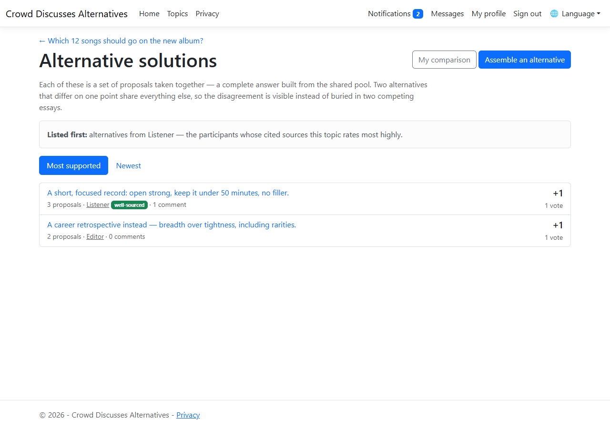

### Why answers are assembled rather than written

When someone writes a whole solution as an essay, everyone else can only accept or reject the
lot. Assembled from proposals, two answers that differ on one point **share every other line** —
so the disagreement is a difference in membership, plain to see, instead of something you have
to extract by reading two documents side by side.

It also means you are never forced to reject an answer you mostly agree with. Take the
combination, change the part you would do differently, and put that forward as its own
alternative.

### Assembling one

**Assemble an alternative** lists the whole pool with a checkbox against each proposal. Pick the
ones that together make up your answer — the order does not matter, it is a set — and say what
the combination amounts to.

The description is **required**, and not as a formality. A bare list of proposals leaves
everyone to guess at the reasoning that selected them, and that reasoning is most of what
distinguishes one alternative from another.

An alternative needs **at least two** proposals. A single proposal is already votable on its own.

### Reading one

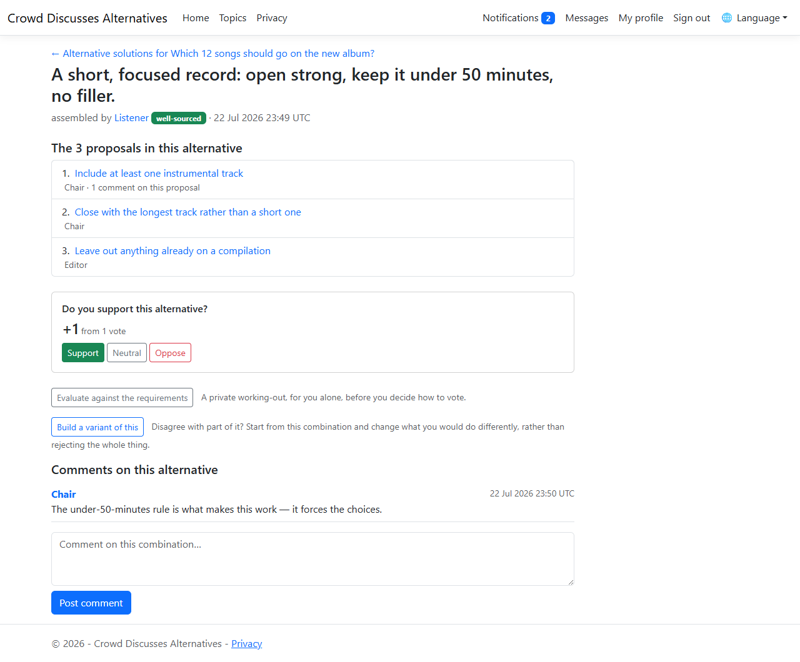

Opening an alternative shows every proposal in it, and how much discussion each has attracted —
the argument about a combination is largely the argument about its parts, so the detail page
points at where that argument is happening.

Alternatives are voted on exactly like anything else: **Support**, **Neutral**, **Oppose**, one
vote each.

### Variants

**Build a variant of this** starts a new alternative marked as a refinement of an existing one.
Use it when you would keep most of an answer and change a detail.

Marking refinements keeps the list readable. Six alternatives that are adjustments of two
underlying approaches is a very different picture from six unrelated answers, and only the
marking tells them apart.

### Whose alternatives come first

The list puts the alternatives of the topic's **best-regarded citers of sources** ahead of the
rest, before the chosen ordering applies — and says so at the top of the page. In the screenshot
above, Listener's alternative is listed first despite both having equal support.

This is the payoff for the ratings in [Sources](#7-sources). The advantage is deliberate: the
quality of a discussion rests on the quality of what it argues from, so whoever does the work of
finding good evidence gets a small structural say in what gets read first.

### Changing one after people have voted

Only the person who assembled an alternative can change it. If votes have already been cast, the
page says so and suggests building a variant instead — a rewritten description changes what
those people judged. It is allowed, since the author may simply be answering criticism, but it
is never silent.

---

## 10. Weighing alternatives up

Voting on an alternative is a single judgement about a complicated thing. **Evaluate against the
requirements** breaks that judgement into its parts, so you can work out what you think before
committing to it.

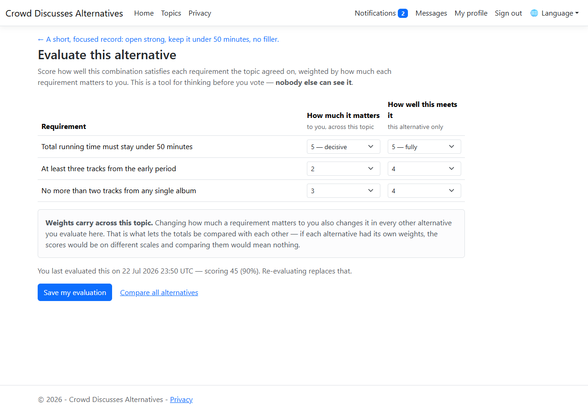

Each requirement gets two numbers from you:

| | |
|---|---|
| **How much it matters** | 0 (irrelevant to me) to 5 (decisive). Your view of the *requirement*. |
| **How well this meets it** | 0 (not at all) to 5 (fully). Your view of *this alternative*. |

The total is weight × score, summed. A requirement you weight 0 cannot influence the result
however well an alternative scores on it.

### Your weights apply across the whole topic

This is the one thing worth understanding properly. **Weights belong to you and the topic, not
to the alternative you happen to be looking at.** Changing how much a requirement matters
changes it everywhere in that topic, and the form says so.

That is not a limitation, it is the point. If each alternative carried its own weights, every
column would be scored on a different scale and putting them next to each other would mean
nothing — you could reach whatever conclusion you liked by adjusting the weights to suit the
answer you already preferred. Sharing them makes the comparison sound by construction.

### Comparing them

**My comparison** lays out every alternative you have evaluated, side by side, under those
shared weights.

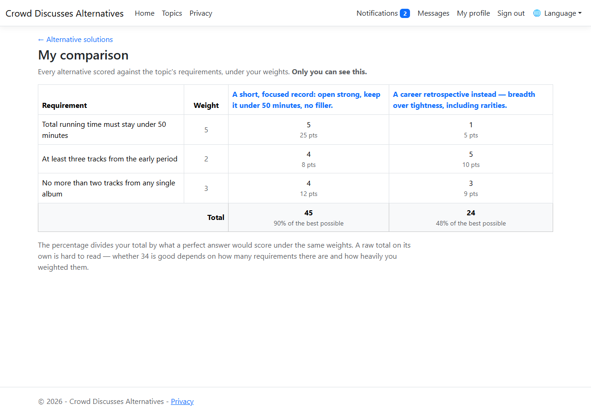

The percentage divides your total by what a perfect answer would score under the same weights. A
raw total on its own is hard to read: whether 45 is good depends on how many requirements there
are and how heavily you weighted them.

In the example above, the two alternatives are close on two requirements and far apart on the
one weighted most heavily — which is exactly the kind of thing a single up-or-down vote hides.

### It is private

**Nobody else can see your evaluation** — not the facilitator, not the person who assembled the
alternative. The vote is the public act; the working behind it is not. Publishing it would turn
a private weighing-up into one more thing to be judged on, and make people reluctant to record
an honest assessment.

You can re-evaluate at any time, and a new evaluation replaces the old one.

---

## 11. Searching, and using comments as tags

**Search the discussion** looks through everything written in a topic — the topic thread,
comments on proposals, comments on alternatives, and justifications on duplicate reports.

### Writing a search

| You type | It finds |
|---|---|
| `congestion charging` | comments containing **both** words |
| `congestion AND charging` | the same thing — adjacent words mean AND |
| `buses OR trams` | comments containing **either** |
| `toll AND (buses OR trams)` | brackets group alternatives |
| `"congestion charge"` | that exact phrase |
| `charging -london` | contains *charging*, but **not** *london* |

`AND` binds more tightly than `OR`, so `toll AND fee OR charge` reads as
`(toll AND fee) OR charge`. Use brackets when you mean something else.

> **Words of one or two characters cannot be found.** The index does not contain them. Rather
> than returning nothing and leaving you guessing, the page lists which words it had to ignore.

### Two ways to see the results

**The matching comments** — what you want when you are looking for a remark you half remember.

**Proposals whose comments match** — what you want when you are using words as labels.

### Using comments as tags

This is the workflow the platform was designed around, and it needs no special feature. As you
read through a pool of proposals, write a marker word in a comment: `pros`, `cons`, `costed`,
`needs-evidence` — whatever labels you find useful. Later, search for that word and ask for
**proposals whose comments match**.

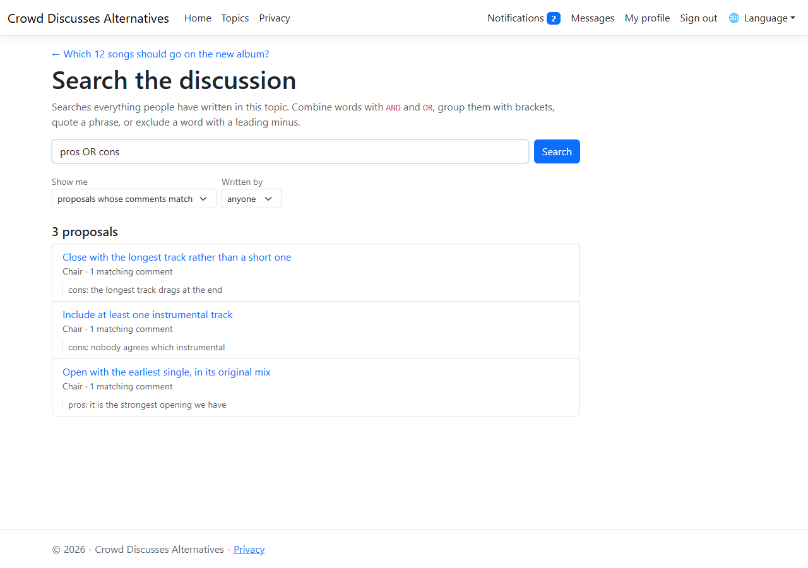

Each result shows the comments that matched, so you can see why it came back.

Two things make this more useful than it first looks:

- **Restrict the search to your own comments** with the *Written by* filter, and your markers
  become effectively private labels — everyone else's `cons` will not interfere with yours.
- **You are not limited to a fixed set of tags.** Any word works, decided as you go, without
  asking anyone to add it.

---

## 12. Factor tables

Solutions usually fail not because a measure does not work, but because it works while damaging
something else that mattered. A **factor table** is somewhere to write that down and look at it.

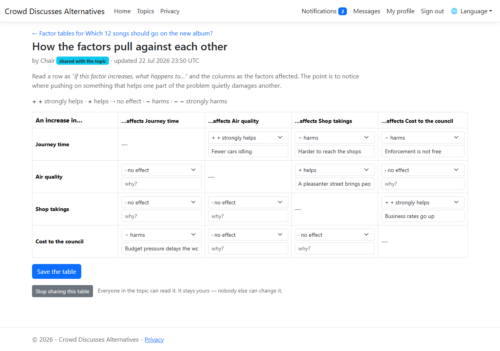

You name the handful of factors that really matter in the problem, and the grid asks you, for
each pair: *if this one increases, what happens to that one?*

| | |
|---|---|
| `+ +` | strongly helps |
| `+` | helps |
| `·` | no effect |
| `−` | harms |
| `− −` | strongly harms |

Every cell takes an optional note, and the notes are usually the most valuable part — the
judgement matters less than the reason for it.

### It is qualitative on purpose

Five coarse steps, not numbers. The point is to notice that pushing on one thing helps here and
hurts there; putting figures on it would invite arithmetic that the underlying guesswork cannot
support.

### The direction matters

*Charging harms shop takings* and *shop takings affect charging* are separate claims, and the
grid holds both independently. Reading down a column shows everything that affects one factor;
reading across a row shows everything one factor disturbs. The diagonal is never filled in — a
factor's effect on itself says nothing.

### Between two and twelve factors

The grid is square, so twelve factors already means over a hundred judgements and a table nobody
can read across. Deciding which factors are genuinely key is part of the exercise.

### Yours, until you share it

A new table is **private to you**. It is a working sketch of how you think the problem hangs
together, and half-formed thinking should not be on show before you decide it is worth showing.

**Share this table with the topic** makes it readable by everyone in the topic — readable, not
editable. It stays yours, carries your name, and is never merged with anyone else's. A shared
table is one participant's reading of the problem, offered to the others, not a fact the topic
has agreed.

---

## 13. Being told what happened

Three things bring you back to a topic: somebody commenting on your proposal, somebody
commenting on an alternative you assembled, and somebody reporting your proposal as a duplicate
of another. All three are recorded on your **Notifications** page, reachable from the navigation
bar — which carries a count of anything unread, so you do not have to open the page to find out
whether there is something on it.

The duplicate report is the one worth reading promptly: if enough people agree with it, your
proposal folds out of the pool's default view (chapter 8), and the time to argue that the two
say different things is before that happens.

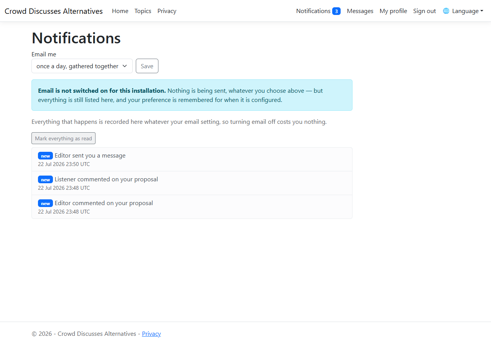

Each entry is a link to the thing that happened, so reading one takes you to it. **Mark
everything as read** clears the list's highlighting without deleting anything.

### You are never told about your own doing

Commenting on your own proposal produces no notification. Being told what you have just done is
noise, and noise is what makes people stop reading notifications at all.

### How often you get email

At the top of the page is one setting with three values:

| Setting | What happens |
|---|---|
| **Once a day, gathered together** | One email collecting everything from the past day. This is the default. |
| **As things happen** | One email per event. |
| **Never — I will look here** | No email at all. |

The default is a digest, not immediate mail, because a busy topic produces a great many events
and an inbox full of them is the fastest way to make someone stop reading any of them.

**Turning email off costs you nothing.** The setting governs email only — everything is still
recorded on the notifications page whatever you choose, so nothing is lost by never being
mailed.

### Email is not switched on yet

This installation has no mail server configured, and the page says so rather than offering a
setting that quietly does nothing. Your preference is remembered, and nothing is thrown away
while email is off: anything that would have been sent stays queued, so when a mail server is
configured the backlog goes out rather than having been silently discarded.

---

## 14. Private messages

Some things genuinely are between two people — asking someone to look at an alternative before
a vote closes, or working out who is writing what. **Messages**, in the navigation bar, is for
those.

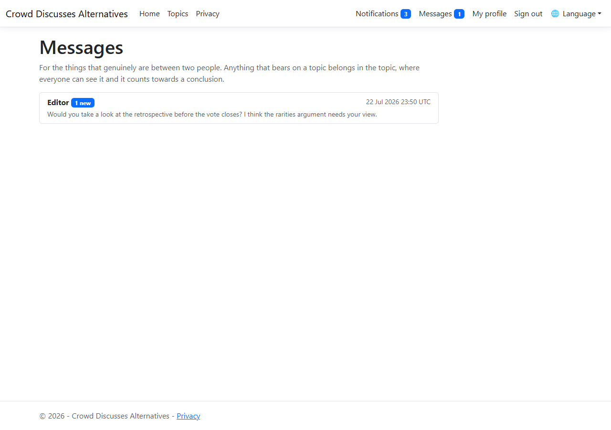

You start a conversation from somebody's profile: **Send a message**. After that the
conversation lives in your Messages list, most recent first, with a count of anything you have
not read.

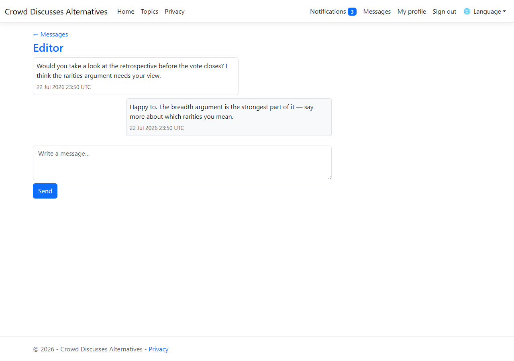

Opening a conversation marks the messages *addressed to you* as read. Your own sent messages are
untouched — opening your side of a thread does not mean the other person has read it. Where they
have, the message says **read** underneath.

### Most things do not belong here

Anything that bears on a topic belongs **in** the topic. A point made in a private message
persuades one person, leaves no record, and counts towards no conclusion; the same point made in
the topic is visible to everyone and can be voted on. Private messages exist for the
arrangements around the discussion, not the discussion itself.

---

## 15. Attaching a file

A proposal can carry files: the survey nobody has put on the web, a spreadsheet of figures, a
photograph of the junction being argued about.

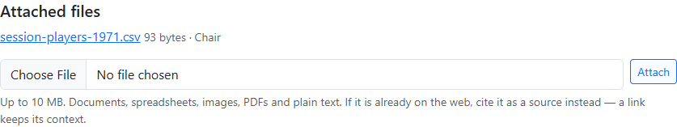

### Cite a link if there is one

If the thing is already on the web, **cite it as a source instead** (chapter 7). A link keeps
its context, can be checked by anyone, and gets rated for accuracy and relevance. A copy
uploaded here has none of that. Attachments are for what has no link of its own.

### What is accepted

| | |
|---|---|
| **Size** | Up to 10 MB per file |
| **Kinds** | Documents, spreadsheets, presentations, PDFs, images, plain text, CSV |

Anything that could run — programs, scripts, web pages — is refused, whatever it is named. This
is a list of what is allowed rather than a list of what is banned: a ban list has to anticipate
every dangerous kind of file and is wrong the moment a new one appears, while an allow list is
wrong only by being inconvenient.

Files are served as downloads, never displayed in the page, and are only reachable through the
topic they were attached to. An attachment in an invite-only topic cannot be fetched by anyone
who is not in that topic.

Attaching follows the same rule as citing: you must be able to take part in the topic, and a
closed topic accepts nothing further.

---

## 16. Reading it in another language

The interface is offered in **English** and **Greek**. Pick one from the **🌐 Language** menu in
the top bar; the choice is remembered on this device, signed in or not, so you only make it once.

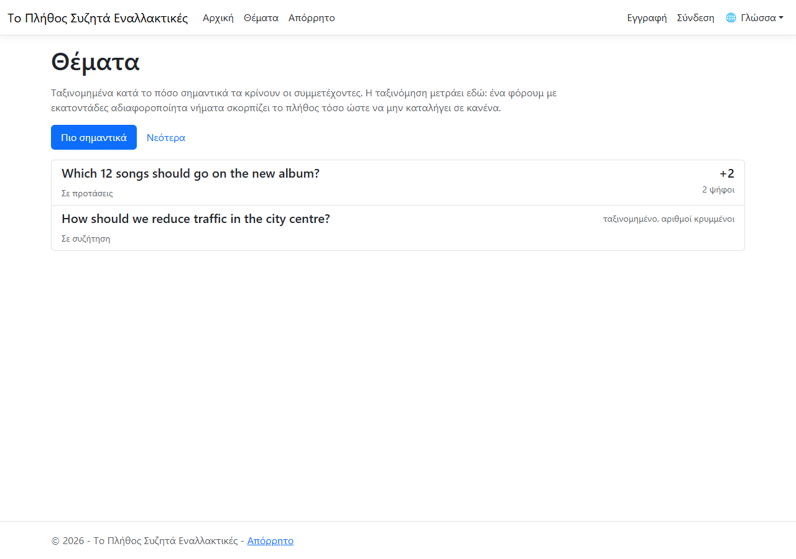

### What is translated, and what is not

The **interface** — every button, label, heading and explanation — is translated. What **people
wrote** is not: a topic's subject, a proposal, a comment and a private message stay in whatever
language their author typed them in. Translating those would mean rewriting someone's words, which
is not the platform's to do. So a Greek reader sees Greek chrome around English (or Greek, or
any-language) content, exactly as written.

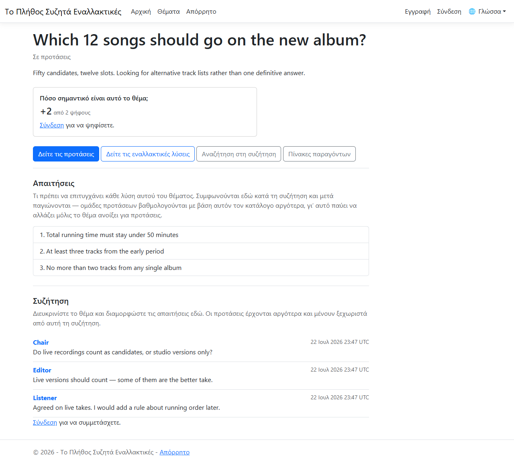

Dates and numbers follow the chosen language too — Greek writes a decimal point as a comma, and
the pages respect that.

### Correcting a translation

The Greek ships as a starting point, not the last word. An administrator has a **Translations**
screen (in the top bar) listing every phrase in the interface beside its Greek, and can correct
any of them; the change takes effect immediately, with no redeployment. English is the source the
phrases are written in, so it is not edited there.

A phrase that has no translation yet simply shows in English rather than breaking — so the site is
always usable, even mid-translation.

---

## 17. Quick reference

| Question | Answer |
|---|---|
| Can I change my vote? | Yes, any time until the topic closes. The new value replaces the old one. |
| What is the difference between Neutral and withdrawing? | Neutral is a recorded opinion and counts as participation. Withdrawing removes your vote entirely. |
| Why can I not see the vote count? | The facilitator chose to withhold tallies until the topic closes. The ranking is still accurate. |
| Why can I not edit the requirements any more? | They froze when the topic opened for proposals. |
| Who can see my email address? | Nobody, unless you change that field's audience. Everything starts private. |
| Can I hide my display name? | No. It appears on everything you post, so a switch for it would be a promise the rest of the platform could not keep. |
| Why did my topic not open for proposals? | It has no requirements yet. Agree at least one first. |
| Why can I not vote on a proposal? | It is still inside its editing window, so its wording could still change. Comment instead. |
| Can I fix a typo in my proposal after it locks? | No. The text is what people voted on. Add a corrected proposal instead. |
| My proposal was rejected as too long. | It is more than one sentence, so it is more than one proposal. Split it. |
| I added a source and it did not appear as new. | Someone had already cited it in this topic, so yours was linked to the existing entry — its rating stays in one place. |
| Why two sets of vote buttons on a source? | Accuracy and relevance are judged separately; a source can be strong on one and weak on the other. |
| A proposal I saw yesterday is gone. | You have folding turned on and someone reported it as a duplicate. Turn folding off, or raise the threshold, to see it again. |
| Why does one entry show a bigger score than its own votes? | It stands for a group of duplicates, so it shows their combined support. |
| Can I merge two proposals myself? | No. You report that they are duplicates; others decide whether they agree, and each reader chooses the threshold at which that folds them. |
| Why is one alternative listed above another with the same score? | Its author is among the topic's best-regarded citers of sources. |
| I agree with most of an alternative but not all of it. | Build a variant: keep the combination, change the part you would do differently. |
| Why must I describe my alternative? | The selection alone does not explain the reasoning behind it, and that reasoning is most of what distinguishes one answer from another. |
| Can anyone see how I scored an alternative? | No. Evaluations are private to you — the vote is the public act, the reasoning behind it is not. |
| I changed a weight and another alternative's total moved. | Weights apply across the whole topic. That is what lets the totals be compared with each other. |
| What does the percentage mean? | Your total as a share of what a perfect answer would score under your own weights. |
| My search found nothing and I know the word is there. | If it is one or two characters it is not in the index; the page says which words it ignored. |
| How do I tag a proposal? | Write a marker word in a comment on it, then search for that word and ask for proposals. Any word works. |
| Can I keep my tags to myself? | Set *Written by* to your own name — then only your own marker comments are matched. |
| Can someone edit my factor table? | No. Sharing makes it readable, never editable — it stays your reading of the problem. |
| Why can I not put numbers in the factor table? | It is a qualitative sketch. Figures would invite arithmetic the underlying guesswork cannot support. |
| I cannot find a topic someone mentioned. | It may be invite-only, in which case it is invisible until you are added. |
| I turned email off — will I miss things? | No. Everything is still listed on your notifications page; the setting governs email only. |
| I am not getting any email. | No mail server is configured for this installation yet. Nothing is lost — it stays queued until one is. |
| Why was I not told about my own comment? | You are never notified about your own doing. |
| Should I send this in a message or post it? | If it bears on the topic, post it. A private message persuades one person, leaves no record, and counts towards nothing. |
| How do I know they read my message? | Their side of the thread says *read* once they have opened it. |
| My upload was refused. | Either it is over 10 MB, or it is a kind of file that could run. Only documents, images, PDFs and plain text are accepted. |
| Should I attach it or cite it? | Cite it if it is on the web — a link keeps its context and can be rated. Attach only what has no link of its own. |
| How do I read the site in Greek? | Pick it from the 🌐 Language menu in the top bar. The choice sticks on this device. |
| Why is the topic still in English after I switched to Greek? | Only the interface is translated. What people wrote — subjects, proposals, comments — stays in the language they typed. |
| The Greek for something is wrong. | An administrator can fix it on the Translations screen; the change shows at once. |

---

## Not built yet

These are designed and scheduled but **do not exist in the running application yet**. They are
listed so this manual is not read as describing more than there is:

| Feature | Phase |
|---|---|
| Email actually going out (a mail server is not configured; see [chapter 13](#13-being-told-what-happened)) | 12 |

The REST API is designed but not yet exposed; today the platform is the web interface only.

---

## Keeping this manual current

The screenshots are generated, not taken by hand, so they cannot drift out of date silently.
[`capture-screenshots.py`](capture-screenshots.py) seeds a small, realistic scenario against a
running instance and writes every image in `images/`.

```bash
# Requires playwright with Microsoft Edge, and a running app on localhost:5105.
# The database it points at is CLEARED first, so never aim it at anything you care about.
python -m pip install playwright pymysql
export CDA_DB_HOST=<host> CDA_DB_USER=<user> CDA_DB_PASSWORD=<password>
python Documentation/capture-screenshots.py
```

Re-run it whenever a phase changes the interface, and update the prose alongside.
