# Crowd Discusses Alternatives — User Manual

> **Status: the platform is under construction.** This manual documents what works today and
> is updated as each phase lands. Everything shown here has been exercised against a running
> instance; the screenshots are generated from a live app, not mocked up. Features that do not
> exist yet are listed in [Not built yet](#not-built-yet) rather than described as if they did.
>
> Last updated after **Phase 6**. See [devplan.md](devplan.md) for the delivery plan.

---

## 1. What this is for

Most forums have the same three problems: discussions rarely reach a conclusion, the few real
proposals get buried inside the commentary, and each proposal is written by one person so
everyone else can only agree or disagree with the whole thing.

This platform is built around a different shape. **A solution is not a single post — it is a
group of small, sentence-sized proposals**, assembled from a shared pool. People who disagree
about one part can assemble a different group rather than rejecting everything, and the
differences between the resulting alternatives are visible instead of buried.

Two consequences run through the whole design:

- **Proposals and commentary are kept structurally apart.** A comment argues about a proposal;
  it never becomes part of a solution.
- **Nothing is decided by the software.** Duplicate proposals, importance, and the quality of
  sources are all judged by the participants, and the tools exist to make those judgements
  visible rather than to make them automatically.

---

## 2. Creating an account

Registration needs an email address, a display name and a password.

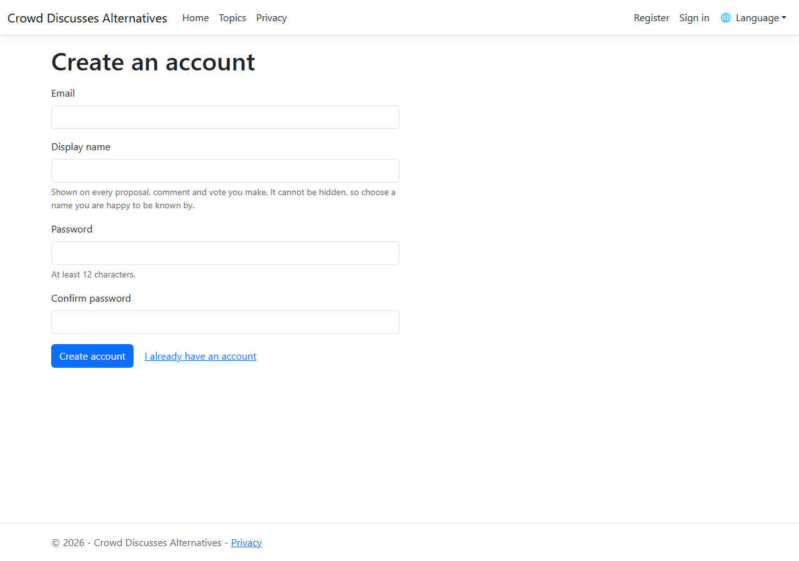

**Your display name appears on everything you post** — every comment, every vote, every
proposal — so it cannot be hidden later. It is also unique across the platform, so that two
participants can never be mistaken for one another mid-discussion. Choose a name you are happy
to be known by.

**Passwords are judged on length, not on punctuation.** The minimum is 12 characters, and there
is no rule demanding a capital letter or a digit. A spoken phrase you can remember is a
stronger secret than `Password1!`, and the usual composition rules rule those phrases out.

> **Not yet:** there is no email confirmation and no password reset, because the platform has
> no mail transport until a later phase. Until then, an address is not verified.

---

## 3. Your profile and who can see it

Every field on your profile carries its own audience: **only me**, **signed-in members**, or
**anyone**.

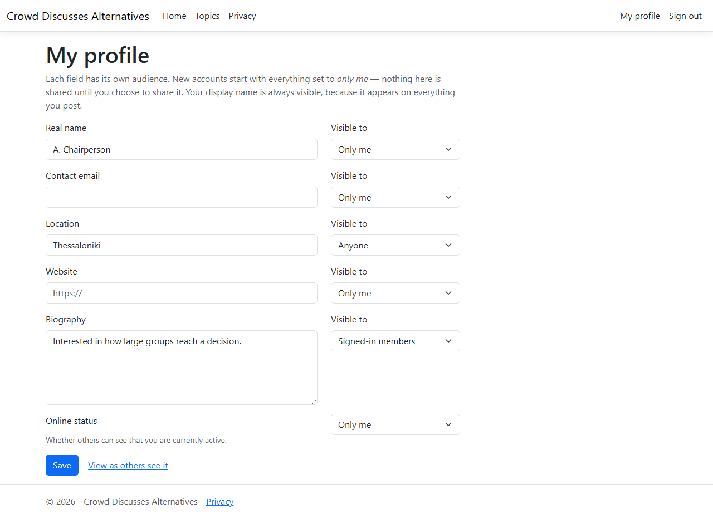

**A new account starts with everything set to *only me*.** Registering publishes nothing beyond
your display name; you decide what to share and when.

The **View as others see it** link shows your profile the way a stranger sees it. Here is the
same profile as an anonymous visitor, with *Location* set to *anyone* and everything else left
private:

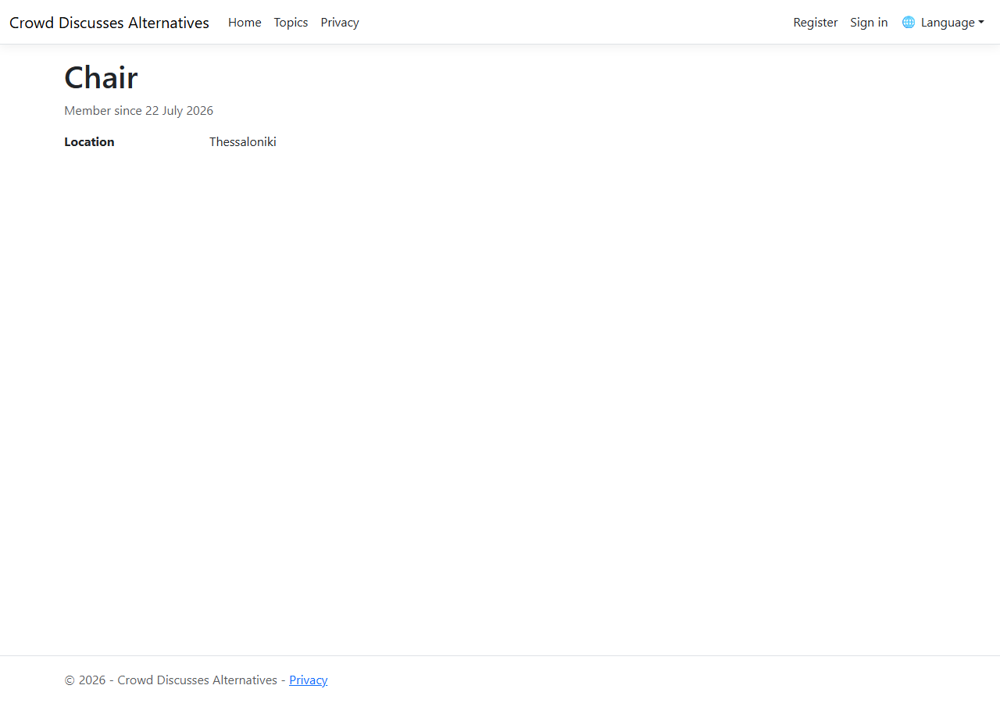

Only the display name, the join date and the location survive. Note that a hidden field looks
exactly like an empty one — the platform does not announce that there is something you are not
being shown.

**Online status** is a field like any other. If you would rather not have people see when you
are active, set it to *only me*.

---

## 4. Topics

A topic is a problem the crowd is working on. Everything else — the discussion, the
requirements, and eventually the proposals and alternative solutions — lives inside one.

### Finding topics

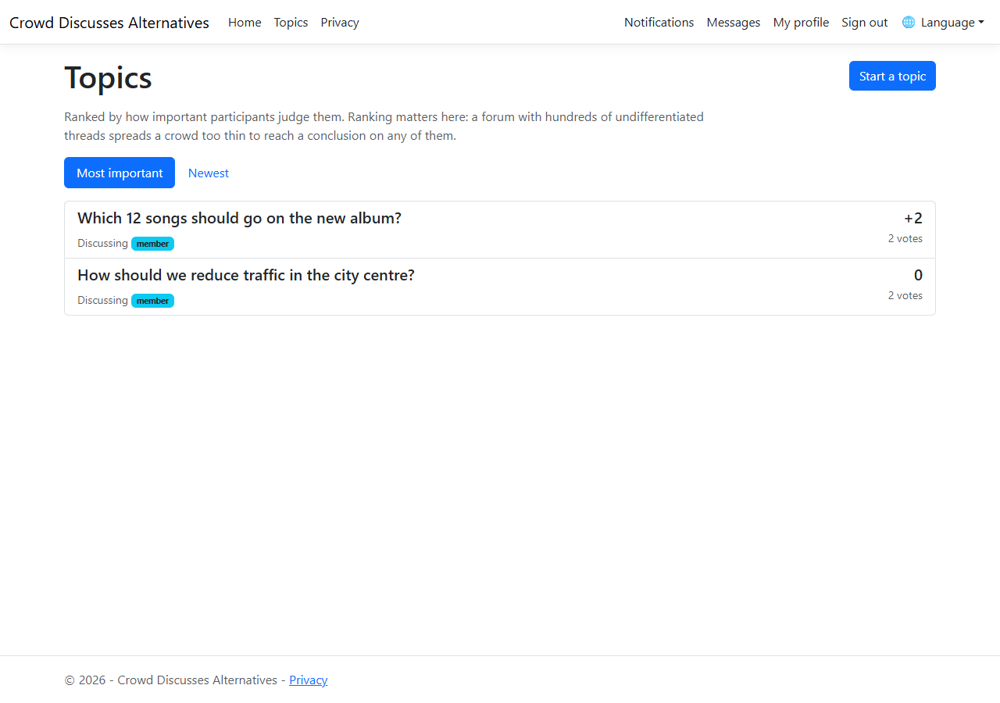

The default order is **by importance**, as judged by the people using the platform. This
ranking is not decoration. In forums with thousands of participants and hundreds of
undifferentiated threads, the crowd spreads too thin for any single discussion to conclude;
ranking is what concentrates attention. You can switch to **Newest** at any time.

A **member** badge marks topics you belong to.

### Starting a topic

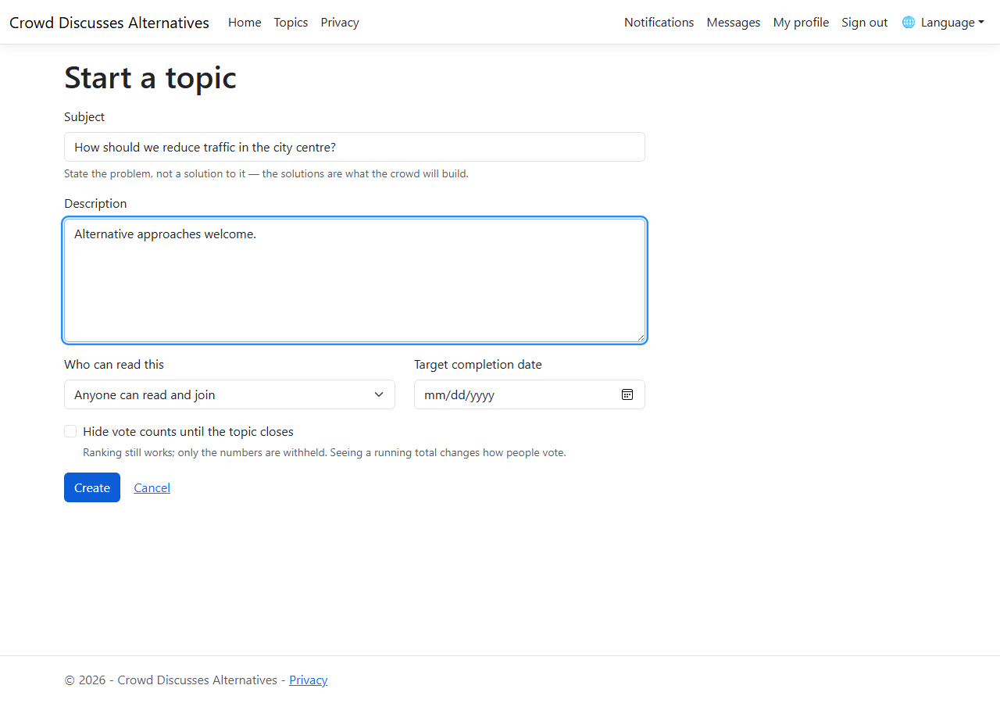

| Field | What it does |
|---|---|
| **Subject** | State the problem, not a solution to it. The solutions are what the crowd will build. |
| **Description** | Background, scope, anything that stops the discussion drifting. |
| **Who can read this** | *Anyone* — public, and any signed-in user can join. *Only members I invite* — invisible to everyone else. |
| **Target completion date** | When the discussion should have concluded. Once it passes, the topic is closed. |
| **Hide vote counts until the topic closes** | See below. |

Whoever creates a topic becomes its **facilitator**.

### Voting on importance

Three values, and no others: **Important** (+1), **Neutral** (0), **Not important** (−1).

- You hold **one vote per topic**. Voting again replaces your previous vote rather than adding
  to it.
- **Neutral is a recorded abstention**, not the absence of a vote. It adds nothing to the score
  but does count as participation, so "fifty people considered this and twenty were neutral"
  stays distinguishable from "thirty people saw it".
- **Withdraw my vote** removes it entirely. That is different from voting Neutral.
- Reading a public topic does not let you rank it — voting requires signing in, so that one
  vote means one person.

### Hidden tallies

A facilitator can choose to withhold the numbers until the topic closes:

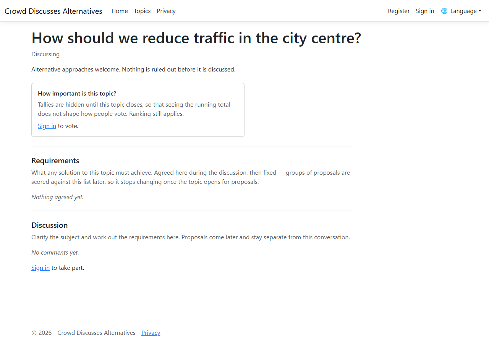

Ranking still works exactly as before; only the figures are withheld. The reason is simple:
seeing that something already has forty votes changes how people vote. The facilitator can
still see the numbers, because they need them to run the discussion.

---

## 5. Running a discussion

### The discussion thread

Every topic has a discussion for working out what the question actually is and what a good
answer would have to achieve. This is deliberately separate from the proposals that come later.

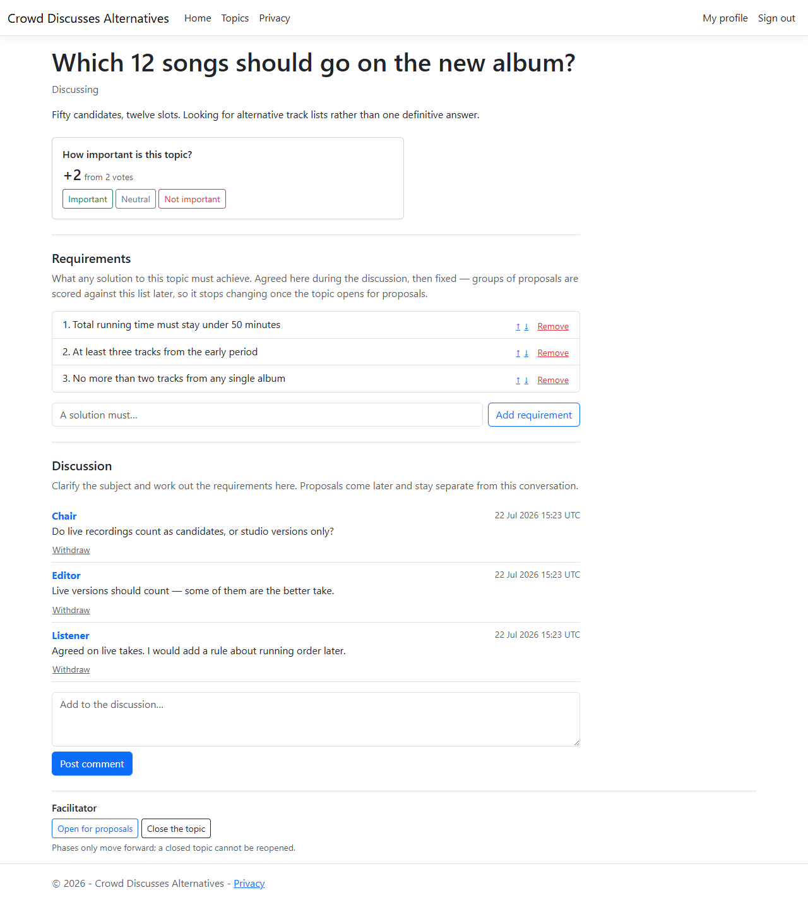

- **Posting to a public topic joins it.** There is no separate request-and-approve step.
- **Only the author can edit a comment**, whatever anyone's role — nobody can put words in
  someone else's mouth. Facilitators can *withdraw* a comment, which is moderation rather than
  rewriting.
- **Withdrawn comments leave a marker** reading *This comment was withdrawn*, instead of
  vanishing. Replies below stop making sense when the remark they answer disappears, and the
  record of how a topic reached its conclusion is part of what the platform is for.

### Agreeing the requirements

The point of the discussion phase is to conclude on a list of **requirements**: what any
solution to this topic must achieve. The facilitator maintains the list, reordering and
removing entries as the discussion settles.

This list matters more than it looks. Later, each alternative solution is scored against it —
so it is both the shared definition of success and the yardstick for comparing competing
answers.

### Opening for proposals

When the requirements are settled, the facilitator uses **Open for proposals**.

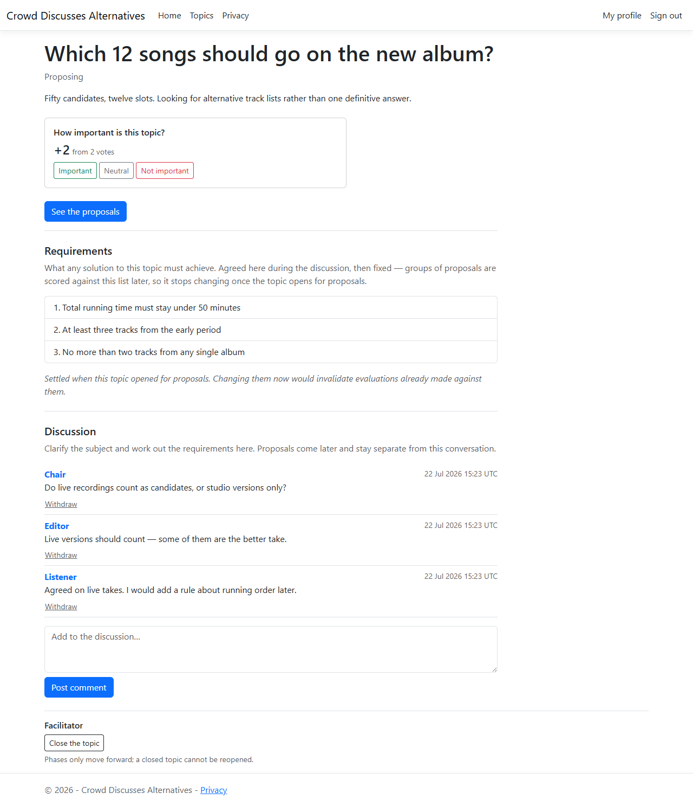

Two things happen, both deliberate:

- **A topic cannot open with an empty requirement list.** Scoring an alternative solution
  against nothing is not a meaningful act, so the platform refuses and says why.
- **The requirement list freezes.** Proposals are written against a published set of criteria
  and groups are evaluated against it; changing the list afterwards would quietly invalidate
  evaluations people had already made.

### Closing

**Close the topic** ends it. A closed topic accepts no votes and no comments, hidden tallies
become visible, and it cannot be reopened — votes were cast on the understanding that the
discussion had ended, and reopening would resurrect them.

Phases only ever move forward: *Discussing* → *Proposing* → *Closed*.

---

## 6. Proposals

Once a topic opens for proposals, its **pool** fills up. This is the part of the platform that
makes it different from a forum.

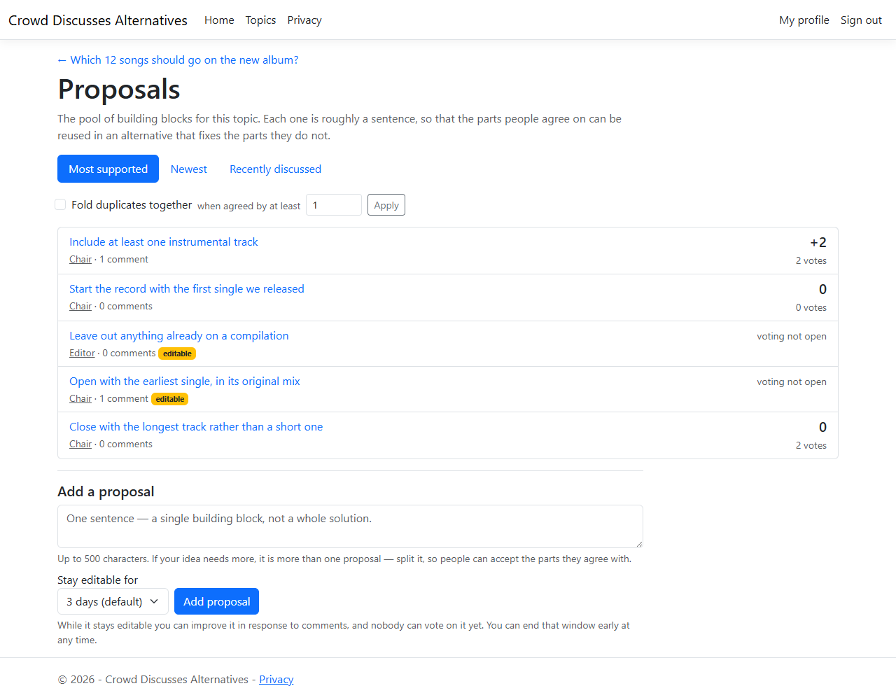

### One sentence each

A proposal is **roughly one sentence**, capped at 500 characters, and the limit is the point
rather than a technical restriction. A whole solution written as one block leaves everyone else
with nothing to do but accept or reject the lot. Broken into pieces, the parts people agree
with survive into an alternative that fixes the parts they do not.

If an idea will not fit, it is more than one proposal. The platform's own documents give the
example: rather than *"a toll of one euro should be charged"*, write

1. *A toll fee is suggested.*
2. *The suggested value of the toll fee is one euro.*

Now someone who supports charging but disputes the amount can back the first and not the
second, instead of rejecting both — and the level of support for the principle stays visible
even while the number is still being argued about.

### The editing window

A new proposal is **open for improvement** for a few days — you choose how long, up to a
month. During that window its author can reword it in response to comments, and **nobody can
vote on it**.

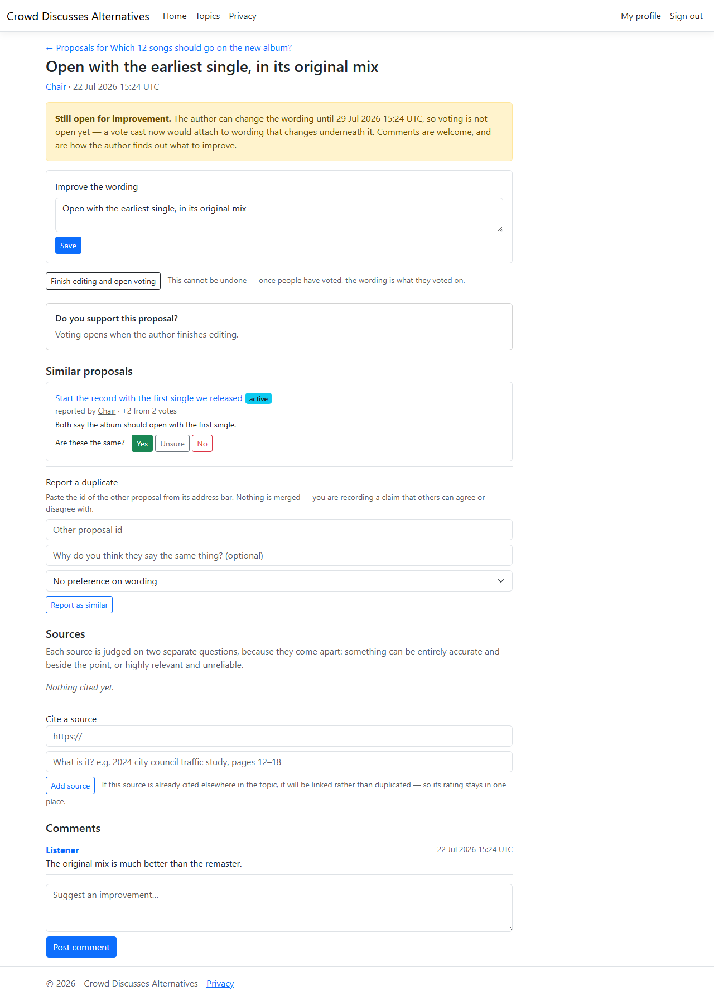

That restriction is deliberate. A vote is a judgement about a specific wording; if the wording
could still change, the vote would end up attached to something its owner never read.
Commenting, by contrast, is exactly what the window is for — it is how the author finds out
what to fix.

**Finish editing and open voting** ends the window early. It cannot be undone, and once the
window closes the text is frozen: from then on it is what people voted on.

The window can be shortened but never extended, so an author who dislikes the way opinion is
forming cannot keep a proposal permanently out of reach of a vote.

### Voting on proposals

Once locked, a proposal votes like anything else — **Support** (+1), **Neutral** (0),
**Oppose** (−1), one vote each, changeable, withdrawable.


### Finding your way around the pool

Three orderings, each answering a different question:

| Ordering | Answers |
|---|---|
| **Most supported** | What does the crowd actually favour? |
| **Newest** | What has appeared since I was last here? |
| **Recently discussed** | Where is the argument happening right now? |

Clicking any author's name filters the pool to their proposals — useful for following someone
whose thinking you want to track, or for reviewing your own.

---

## 7. Sources

A proposal is worth what the evidence behind it is worth. Any member can cite a source against
any proposal, and any member can judge it.

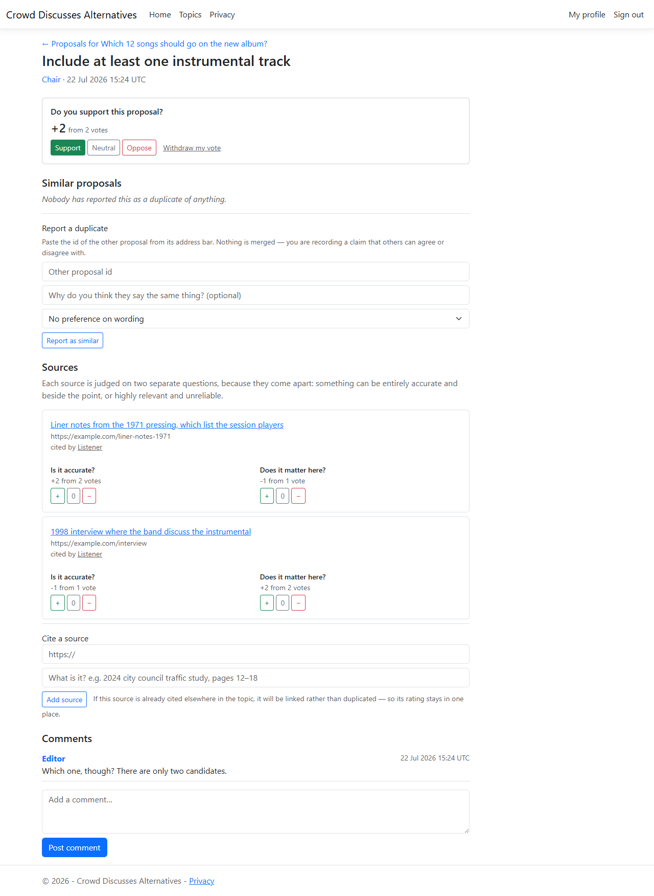

### Two questions, not one

Every source is rated on two independent axes:

| Question | What a negative answer means |
|---|---|
| **Is it accurate?** | The source is unreliable, outdated, or misrepresents what it reports. |
| **Does it matter here?** | The source may be impeccable, but it does not bear on this topic. |

Keeping them apart is the point. A government statistics release can be entirely accurate and
completely beside the question being asked; a partisan blog post can be squarely on the point
and untrustworthy. Collapsing both into one score would hide exactly the distinction that makes
a source worth arguing about — and in the screenshot above, the two sources have opposite
profiles for precisely that reason.

You hold **one vote on each axis** per source, so two votes in total, each independently
changeable.

### One source, one entry

A source is stored **once per topic**. Cite something that has already been cited and the
existing entry is linked to your proposal instead of a second one being created — the panel
tells you when a source supports other proposals too.

Addresses are compared after normalisation, so these all count as the same source:

```
https://example.com/article
HTTPS://Example.com/Article/
https://example.com/article?utm_source=newsletter
https://example.com/article#section-3
example.com/article
```

Tracking parameters, trailing slashes, default ports, letter case in the host and `#fragments`
are all discarded; genuine query parameters are kept and sorted. Without this, the same study
would accumulate several entries with the ratings split between them, and the ratings would
stop meaning anything.

`http://` and `https://` are deliberately **not** merged. They are usually the same document,
but rewriting someone's `http` citation to `https` would break it outright on a host without
TLS, and a dead link is worse than a split rating.

Only `http` and `https` addresses are accepted.

### Why it is worth citing well

The platform keeps track of how well regarded each participant's sources are within each topic.
When alternative solutions are listed — a later phase — those proposed by the three
best-regarded citers appear first.

That advantage is deliberate. The quality of a discussion rests on the quality of what it
argues from, so the person who does the work of finding good evidence gets a small structural
say in what gets read.

---

## 8. Duplicates

With a large enough crowd, the same idea gets proposed several times in slightly different
words. Left alone this is corrosive: support for one idea is divided between three entries, and
each of them looks weaker than the idea actually is.

**The platform never decides that two proposals are the same.** It gives people a way to say
so, a way to disagree, and a dial for how much agreement each reader wants before duplicates
are folded together for them.

### Reporting a duplicate

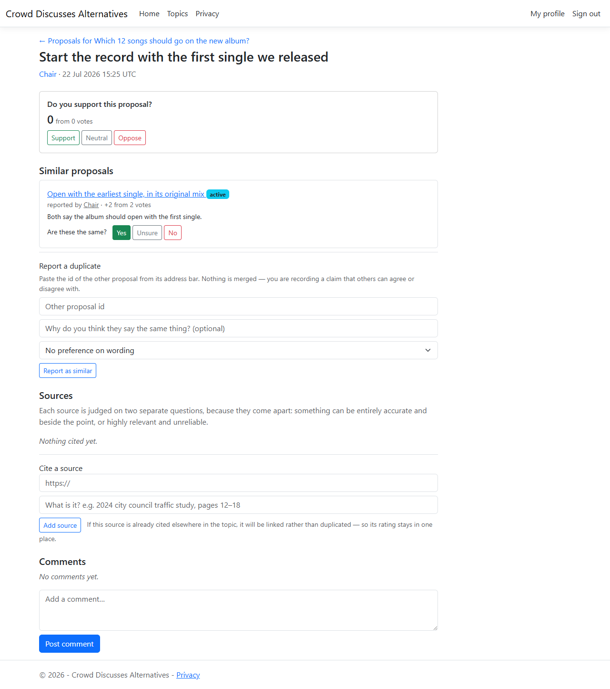

Anyone can report a pair, optionally saying why and which of the two is better written. Nothing
merges at that moment — a report is a claim, and other people vote **Yes**, **Unsure** or **No**
on whether they agree.

The pair is stored in a fixed order, so reporting "A is like B" and "B is like A" is the same
claim. Otherwise the votes that decide whether it takes effect would be split across two rows —
the very problem being solved.

### Folding them together

On the proposal list, **Fold duplicates together** turns folding on, and the number beside it
is how many net votes of agreement a report needs before it counts *for you*.

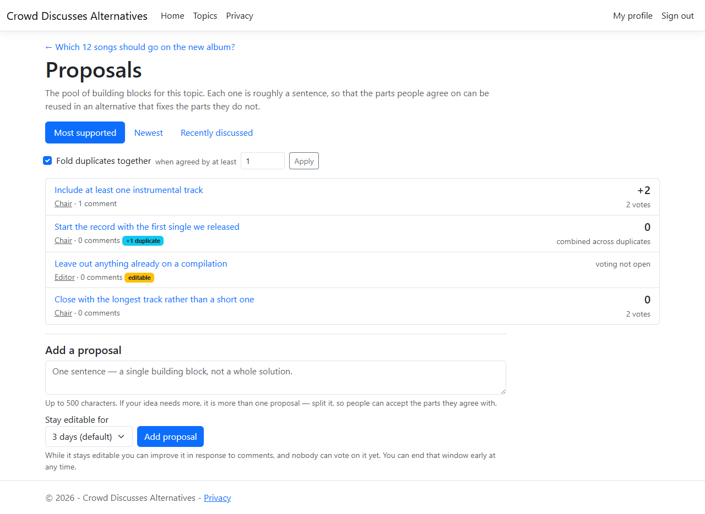

- Folding is **off by default**. Nothing disappears from your view unless you ask for it.
- The threshold is **yours**. Set it to 1 to fold on a single agreement; raise it if you would
  rather see everything until a claim is well established.
- A group shows **one entry** with a `+N duplicates` badge, and its score is the **combined**
  support of the whole group — because that support belongs to the idea, not to whichever
  wording happened to be listed.
- Reports form chains. If A is agreed similar to B, and B to C, then all three fold into one
  entry; showing A and C separately would still split the same idea.
- The entry shown is the one **reporters judged better written**, falling back to the most
  supported. The person who noticed the duplication read both closely, so their judgement of
  the wording is the best signal available.

### Do not split your own vote

If you agree that two proposals say the same thing, but support one and oppose the other, you
are dividing an idea against itself. The platform points this out:

> You agree these two say the same thing, but you voted **1** on this one and **−1** on the
> other. That splits the support for a single idea across two entries. Consider voting the same
> on both.

It is advice, not a rule — you are never prevented from voting as you see fit.

---

## 9. Quick reference

| Question | Answer |
|---|---|
| Can I change my vote? | Yes, any time until the topic closes. The new value replaces the old one. |
| What is the difference between Neutral and withdrawing? | Neutral is a recorded opinion and counts as participation. Withdrawing removes your vote entirely. |
| Why can I not see the vote count? | The facilitator chose to withhold tallies until the topic closes. The ranking is still accurate. |
| Why can I not edit the requirements any more? | They froze when the topic opened for proposals. |
| Who can see my email address? | Nobody, unless you change that field's audience. Everything starts private. |
| Can I hide my display name? | No. It appears on everything you post, so a switch for it would be a promise the rest of the platform could not keep. |
| Why did my topic not open for proposals? | It has no requirements yet. Agree at least one first. |
| Why can I not vote on a proposal? | It is still inside its editing window, so its wording could still change. Comment instead. |
| Can I fix a typo in my proposal after it locks? | No. The text is what people voted on. Add a corrected proposal instead. |
| My proposal was rejected as too long. | It is more than one sentence, so it is more than one proposal. Split it. |
| I added a source and it did not appear as new. | Someone had already cited it in this topic, so yours was linked to the existing entry — its rating stays in one place. |
| Why two sets of vote buttons on a source? | Accuracy and relevance are judged separately; a source can be strong on one and weak on the other. |
| A proposal I saw yesterday is gone. | You have folding turned on and someone reported it as a duplicate. Turn folding off, or raise the threshold, to see it again. |
| Why does one entry show a bigger score than its own votes? | It stands for a group of duplicates, so it shows their combined support. |
| Can I merge two proposals myself? | No. You report that they are duplicates; others decide whether they agree, and each reader chooses the threshold at which that folds them. |
| I cannot find a topic someone mentioned. | It may be invite-only, in which case it is invisible until you are added. |

---

## Not built yet

These are designed and scheduled but **do not exist in the running application yet**. They are
listed so this manual is not read as describing more than there is:

| Feature | Phase |
|---|---|
| Grouping proposals into alternative solutions | 7 |
| Scoring a group against the requirements with your own weightings | 8 |
| Searching comments with AND/OR queries | 9 |
| The qualitative table of how key factors influence each other | 11 |
| Email notification, personal messages, file attachments | 12 |
| A second interface language | 13 |

The REST API is designed but not yet exposed; today the platform is the web interface only.

---

## Keeping this manual current

The screenshots are generated, not taken by hand, so they cannot drift out of date silently.
[`capture-screenshots.py`](capture-screenshots.py) seeds a small, realistic scenario against a
running instance and writes every image in `images/`.

```bash
# Requires playwright with Microsoft Edge, and a running app on localhost:5105.
# The database it points at is CLEARED first, so never aim it at anything you care about.
python -m pip install playwright pymysql
export CDA_DB_HOST=<host> CDA_DB_USER=<user> CDA_DB_PASSWORD=<password>
python Documentation/capture-screenshots.py
```

Re-run it whenever a phase changes the interface, and update the prose alongside.
